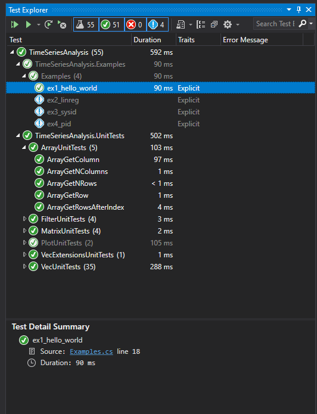

## Setting up and running unit tests 

> [!Note]
> Unit tests are an important part of the documenting this class library, as they give examples of how to run the public interface of the library, and document 
> the expected output. Thus, unit tests are worth studying even for users who do not intend to write or modify unit tests.

Unit tests are implemented using NUnit 3.
In ``Visual Studio`` you should be able to browse the unit tests in the window ``Tests>>Test Explorer``. In the ``Test Explorer`` window, pressing ``Run All tests`` should cause
all tests to turn ``green``. 

In some cases, it may be that the tests appear grayed or or with a blue exclamation point beside them. That indicate an issue with the installation of the ``Nunit3TestAdapter`` 
package through NuGet, which is required for integration NUnit with Visual Studio. 




> [!Note]
> If you want to submit a pull request for new functionality, writing a new a unit test is required.

> [!Note]
> Note that some tests related to plotting are ``Explicit``, and will need be run one-by-one. This has been done this way as this tests require manual inspection, and to avoid
> drowning the user in plots when re-running unit tests. 

## Nuget package upload how-to

*You do not need to follow this section, as these workflow is now integrated in a GitHub action that
runs on every commit. This section is kept as documentation of how this was set up.*

This is  .NET framework 4.7.2 class library published to github packages, by means of the following tutorial:
https://github.community/t/publish-net-framework-nuget-package/3077/2
and here:
https://docs.microsoft.com/en-us/nuget/create-packages/creating-a-package-msbuild

Note that the steps here are somewhat different to most online tutorials which target .NET Core and use the "dotnet" CLI instead of "nuget" CLI.

For future reference, this is the steps followed:

* make sure the classes you want to give access to are public.

* the description that will be shown in nuget when downloading is pulled from <description></description> in the .csproj file beneath <propertygroup>. Consider adding it.
Also add the the url to the repository and some other info such as shown below:
	
```
    <RepositoryUrl>https://github.com/equinor/TimeSeriesAnalysis</RepositoryUrl>
    <RepositoryType>git</RepositoryType>
    <GeneratePackageOnBuild>true</GeneratePackageOnBuild>
    <PackageOutputPath>bin\debug\</PackageOutputPath>
    <Version>1.0.0</Version>
    <Authors>Steinar Elgsæter</Authors>
	<description>todo</description> 
```	

* recommend adding in information to the AssemblyInfo.cs before starting.
* a personal access token xxxxxxx needs to be generated for your user in github,and needs access to "read:packages", 
"write:packages" and "repo".organization access (authorize with SSO ) and then press "authorize"
* create a nuget.config file that defines "github" as a nuget destination:

```	<?xml version="1.0" encoding="utf-8"?>
	<configuration>
		<packageSources>
			<clear />
			<add key="github" value="https://nuget.pkg.github.com/equinor/index.json" />
			<add key="nuget" value="https://api.nuget.org/v3/index.json" />
		</packageSources>
	 <packageSourceCredentials>
			<github>
				<add key="Username" value="yourgithubuser" />
				<add key="ClearTextPassword" value=xxxxxxx" />
			</github>
		</packageSourceCredentials>
</configuration>
```

* pacakges.nuget needs to be moved into project file *.csproj as <packagereference> items instead
* NuGet.Build.Tasks.Pack need to be added as a pacakage to project
* need to download nuget.exe and use it to push generated .nupkg file

* then to publish put the following two commands in a publish.bat file:
```	
	nuget setapikey xxxxxxxx -source "github"
	nuget push bin\Debug\*.nupkg -source "github" -SkipDuplicate
	pause
```

* check that the script concludes with "Your package was pushed" and no error messages in yellow or red.

* notice that you need to iterate the version number in your .csproj file every time you push a new version of the package.


> [!Warning]
> Make sure that you do not check-in the nuget.config file you create, as it contains a *secret* token. Add nuget.config to your git ignore file.


	