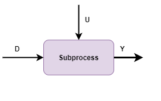
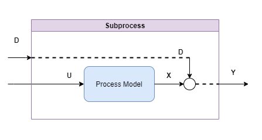
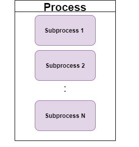
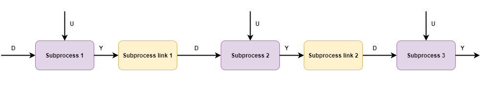
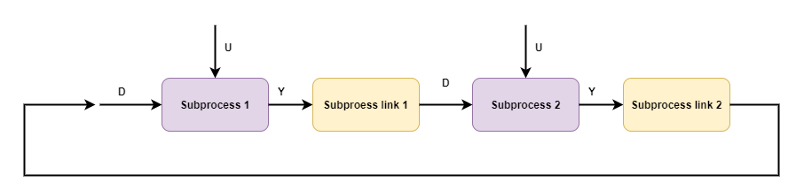

# Dynamic simulation

The building block of the dynamic simulation are referred to as *subprocesses*

where subsystem has has

- a scalar output ``Y``
- a scalar disturbance input ``D`` (not directly manipulated)
- a scalar or vector of manipulated variables ``U``.

A standard PID-control loop can be implemented as a subsystem:

or it can simply be a single-input or multiple input to single output process model *without* feedback:

. 

The aim of the dynamic simulation is to support dynamic simulation of entire *process* sections.
A process is in general any set of subprocesses

The point of co-simulating set of subprocesses is that they may be connected for instance

- subprocesses connected in series

- subprocesses that are connected in process-feedback loops 

- subprocesses that are controlled by PID-controllers, and 

- combinations of the above

