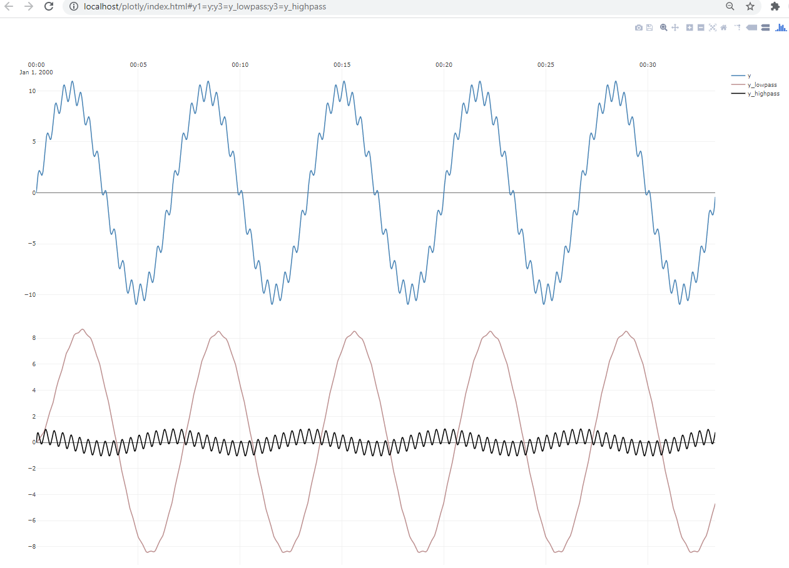

# Example 3 : Filtering

``TimeSeriesAnalysis`` includes basic recursive filtering through the classes ``LowPass``, ``HighPass`` and ``BandPass``.

To illustrate their capabilities, we create an artificial dataset which is made of two sinusoids ``sinus1`` and ``sinus2``of different amplitudes and 
frequencies. Sinuses are implemented in the built in ``SinusModel`` class, and can be simulated by ``ProcessSimulator``. 
The two sinues are added together by calling ``ProcessSimulator.Simulate()`` twice on the same ``ProcessDataSet``. 

Now, we want to define a ``LowPass`` and ``HighPass`` filter that can separate out the high-frequency and low-frequency sinuses, and this 
is mainly a matter of choosing appropriate filter time constants of either filter. 

``sinus1`` has an period of ``400`` seconds, and thus goes from maximum to minimum amplitude in about ``~200`` seconds. 
Remembering that a first-order system by rule-of-thumb will take about 5 time-constants to implement 99% of a change,
motivates a time constant of ``200/5=40`` seconds for the low-pass filter. 

By a similar logic,as ``sinus2`` has a period of ``25`` seconds will go from maximum to minimum amplitude in about 12 seconcds, 
thus motivating a filter time-constant of about ~`3`` seconds.


```
public void Ex3_filters()
{
    double timeBase_s = 1;
        int nStepsDuration = 2000;
    var sinus1 = new SinusModel(new SinusModelParameters 
        { amplitude = 10, period_s = 400 },timeBase_s);
    var sinus2 = new SinusModel(new SinusModelParameters 
       { amplitude = 1, period_s = 25 }, timeBase_s);

    var dataset = new ProcessDataSet(timeBase_s, nStepsDuration);
    ProcessSimulator<SinusModel, SinusModelParameters>.Simulate(sinus1, ref dataset);
    ProcessSimulator<SinusModel, SinusModelParameters>.Simulate(sinus2, ref dataset);

    var lpFilter = new LowPass(timeBase_s);
    var lpFiltered = lpFilter.Filter(dataset.Y_sim,40,1);

    var hpFilter = new HighPass(timeBase_s);
    var hpFiltered = hpFilter.Filter(dataset.Y_sim,3,1);

    Plot.FromList(new List<double[]> { dataset.Y_sim, lpFiltered, hpFiltered },
         new List<string> { "y1=y","y3=y_lowpass","y3=y_highpass" }, (int)timeBase_s);
 }
```

Running the above code results in the below plot. Notice how the two filtered time-series ``y_lowpass``
and ``y_highpass`` approximate the high-frequency and low-frequency component of the original combined ``y``.

