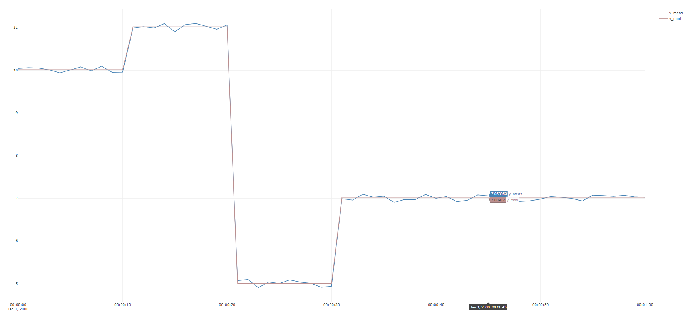

# Example 2 : Linear regression example

In this example, a synthetic dataset is created with the help of helper methods from ``TimeSeriesAnalysis``, 
then ``Vec.Regress`` is used to do linear regression on the dataset to determine the parameters which 
best describe the relationship between inputs ``u1,u2,u3`` and output ``y``. 
``Vec.Rand`` is used to add noise to the dataset, ``Vec.Mult`` is used to multiply vector and scalars

The code:
[!code-csharp[Examples](../Examples/GettingStarted.cs?name=ex_2)]

The dataset :


> [!Note]
> The above is an example of how to plot time-series on multiple y-axes, which is extremely useful to visualize 
> input/output relationships. 

The resulting modeled ``y_modelled`` compared to ``y``:



The estimated parameters (rounded to three significant digits) returned are:
```
[1.02;2.01;3.02;5.01]
```
which is very close to the *true* values:
```
[1;2;3;5]
```
> [!Note]
> The returned vector of parameters will be slightly dependent on the ``seed`` number given to ``Vec.Rand()``, but if the inputs ``U``
> have enough *excitation*, the significance should be minimal. 

The returned *Rsquare* is ``99,9``, indicating that in this case the model describes variations in the dataset very well, as should be expected in this case, 
as we have generated the dataset from a linear model that has the same structure as that used by ``Vec.Regress`` with the same inputs, and all three inputs vary enough
and interdependently of each other. 