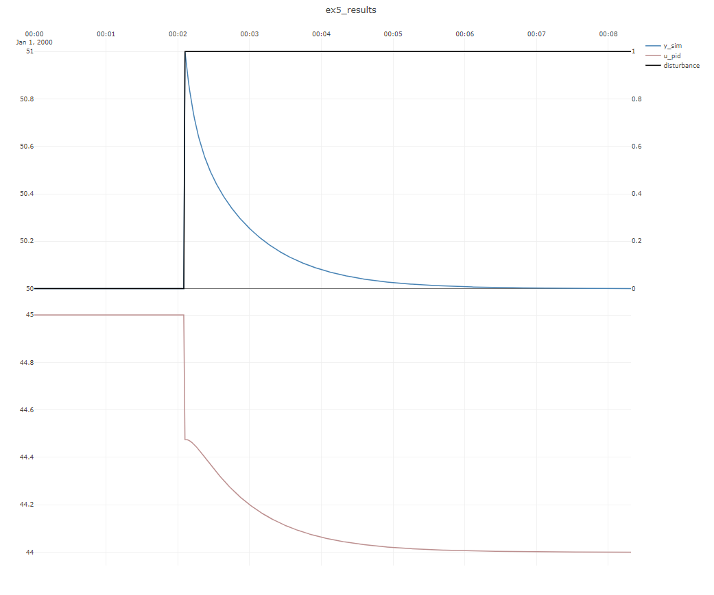

# Example 5 : Simulating a single PID-controller

In this example, a step disturbance influences a linear subprocess that is controlled by a PID-controller toward a constant setpoint of ``y=50``, like depicted in the below figure:

``SubProcessSimulator.CoSimulateProcessAndPID`` co-simulates a single PID-controller/processes combination such as this.

[!code-csharp[Examples](../Examples/GettingStarted.cs?name=ex_5)]

The resulting dynamic simulation:

Note that the PID-controller is able to bring the subprocess back to the setpoint despite the disturbance. 
The initial fast response of the proportional term ``Kp`` is seen in the plot of ``u_pid``, followed by the gradual
influence of the integral term ``Ti_s``, as is expected.

> [!Note]
> ``SubProcessSimulator`` ensures that the PID/model combination starts in *steady-state*, so there is no ``bump`` or transient in the
> start of the dataset.

> [!Note]
> Normally in industrial settings, PID-controllers are scaled, scaling information can be included by the inputting a ``PIDscaling`` to the
> ``PIDModelParameters`` object on initialization.

> [!Note]
> ``CoSimulateProcessAndPID`` is only intended for simple single-input/single-output pid/model systems. For more general simulation, use ``ProcessSimulator`` class.