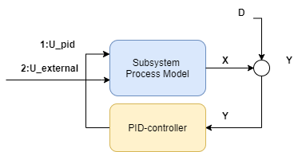

# Example 6 :Larger-scale dynamic process simulation 

The last example illustrated one very simple "process" consisting of a single PID-controller and a single-input/single-output process model,
which could be simulated using ``CoSimulateProcessAndPID``.

Most systems of interest are more complicated, as each each model may have more than one input, and there may be several different PID-controllers and several 
subprocess-models interacting. Simulation of these kinds of systems is done using the class ``PlantSimulator``.

To keep things familiar this example extends on the previous. The subprocess-model is extended to *two inputs*, one external input signal is added in 
addition to the pid-signal input as shown below:



The second output is given a gain of ``2`` by adding a second process 
gain to ``modelParamters``:
```
 ProcessGains = new double[] { 1,2 },
```

Then the process simulator class is initialized, it needs a list of all models classes that will be simulated:
```
var sim = new PlantSimulator (timeBase_s, 
    new List<ISimulatableModel> { pidModel, processModel  });
```
Then the two models ``pidModel`` and ``processModel`` need to be given two connections to make the feedback loop:
```
sim.ConnectModels(processModel,pidModel);
sim.ConnectModels(pidModel, processModel, (int)INDEX.FIRST);
```
Notice that since ``processModel`` now has two inputs, we need to specify which input the ``pidModel`` connects to.
If you like, you can use the enum ``INDEX`` to produce more readable code, or just specify the integer directly.

Similarly to the previous example, a disturbance with a step of amplitude ``1`` is added 1/4th of the way through the dataset is added to the process model:
```
sim.AddSignal(processModel, SignalType.Distubance_D,TimeSeriesCreator.Step(N/4,N,0,1));
```
and a constant setpoint  of ``50`` is applied to the process model:
```
sim.AddSignal(pidModel, SignalType.Setpoint_Yset, TimeSeriesCreator.Constant(50, N));
```
> [!Note]
>``SubProcessSimulator.CoSimulateProcessAndPID`` co-simulates a single PID-controller/processes combination such as this, if you set the below signal to zero,
> for instance by setting the value ``TimeSeriesCreator.Step(0,N)`` then the simulation in this example will replicate the previous simulation in the previous example *exactly*.

Then to extend the example, add a step change from ``0`` to ``1`` in the external input:
```
sim.AddSignal(processModel, SignalType.External_U, TimeSeriesCreator.Step(N / 2, N, 0, 1), (int)INDEX.SECOND);
```
making sure to apply this signal to the second input of the ``processModel``.

After all connections are made and signals added, then simulation is done using 
```
var isOk = sim.Simulate(out TimeSeriesDataSet simData);
```
This method outputs an object of the type ``TimeSeriesDataSet`` that stores all the time-series of the simulation, both the signals added above and the simulated
values, which can be accessed through convenient getters.
For example the simulated output of ``processModel`` can be extracted from ``simData`` like this:
```
simData.GetValues(processModel.GetID(),SignalType.Output_Y_sim)
```

Notice how ``AddSignal`` applies a ``SignalType`` to each signal, this is then used internally in ``Simulate``, but is also used to make it easier to extract and interpret signals
after the simulation.


The entire code:

[!code-csharp[Examples](../Examples/GettingStarted.cs?name=ex_6)]

The resulting dynamic simulation:


The effect of the disturbance step entering 1/4th of the way through the dataset and then being rejected is seen, and is in fact exactly like 
in the previous example, but now a step change in the input is also seen half-way through the dataset.

> [!Note]
> This example illustrates the work-flow that supports large-scale simulations, but the process example 
> considered is still quite small. For examples of large-scale simulations, refer to the section on dynamic simulation.

