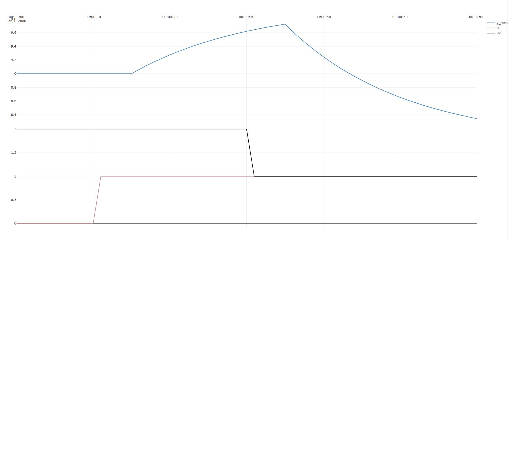
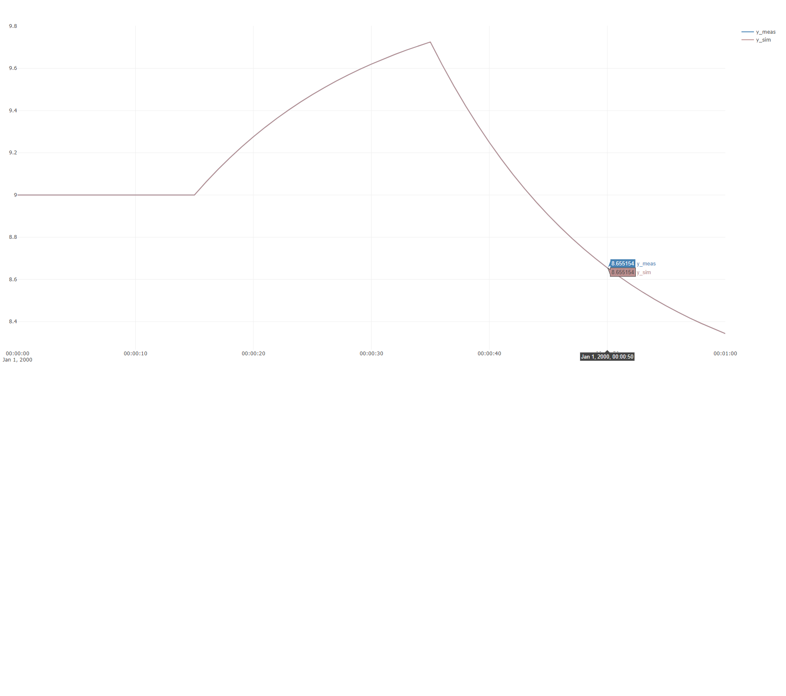
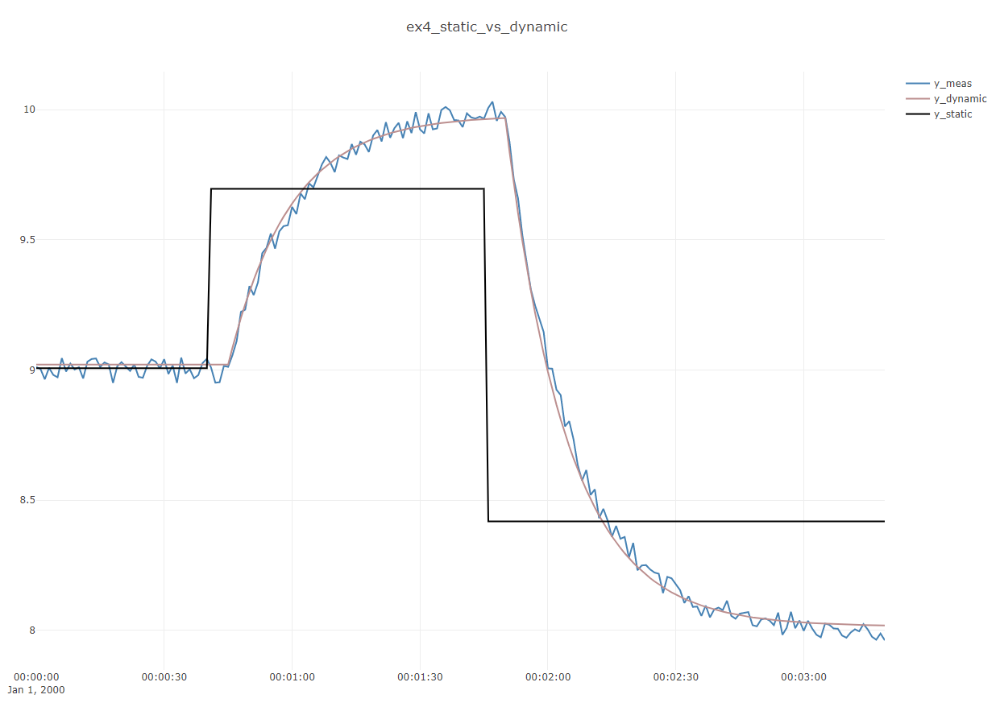

# Example 4 : Fitting a dynamic model to transient data 

**In this example, it is shown how to use the built-in dynamic identification algorithm
to find a dynamic model to describe a measured time-series depening on multiple inputs.**

A synthetic dataset with two inputs ``u1`` and ``u2`` is created using ``ProcessSimulator``
and the ``DefaultProcessModel`` (the output ``y_meas`` depends linearly on the two inputs), and noise
is added to the data. The advantage of a synthetic dataset is that we know the true underlying
paramters, which is very useful for testing and validating methods.
In this case the "true" *time-delay* of ``5`` seconds, *time-constant* of ``15`` seconds and *process gains*
``{1,2}`` are chosen.

*The aim of this example is to see how closely the ``DefaultProcessModelIdentifier`` is able to estimate these values.*

The code to create the dataset, do the identification and create the plots is shown below:

[!code-csharp[Examples](../Examples/Examples.cs?name=ex_4)]

The first plot shows the dataset, showing inputs``u1``, ``u2`` and output ``y``:



**Notice of the time-delay and time-constant are clearly visible in this dataset**. 
The resulting fit between model and dataset is shown below. The two time-series are virtually identical, except that
the modelled output does not have any noise.



The resulting console output gives more detail on the parameters found:

```
DefaultProcessModel
-------------------------
ABLE to identify
TimeConstant : 14,1 sec
TimeDelay : 5 sec
ProcessGains : [0.958;1.96]
ProcessCurvatures : null
Bias : 8,87
u0 : [0.796;1.54]
-------------------------
fitting objective : 0,3136
fitting R2: 84,27
fitting : no error or warnings
```

Notice how the process gains ``[0.958;1.96]`` are fairly close to the true ``[1;2]``, 
the time constant ``14,1 sec`` is fairly close to the true ``15 sec`` and the time delay is spot-on at ``5 sec``.

R-squared ("R2") is ~84 out of 100 maximum, and this indicates a relatively good match of the model.

R-squared could have been increased, and the even better estimates could have been obtained for a longer dataset, and 
by either including more steps in the data, or by fully allowing the first step response to reach steady-state before
continuing with the second step. Reducing the noise also improves estimates and increases R2, but of course that is not 
an option in real-life.

## Comparsion: static versus dynamic model
 
**As an instructional example, the dynamic model above is compared to what is found by ``normal`` linear regression on 
this dataset.** 
 
Linear regression is accomplished by ``Vec.Regress`` using the code below: 
 
```
// compare dynamic to static identification
var regResults = Vec.Regress(dataSet.Y_meas, U);
Plot.FromList(new List<double[]> { identifiedModel.FittedDataSet.Y_meas,
	identifiedModel.FittedDataSet.Y_sim,regResults.Y_modelled },
	new List<string> { "y1=y_meas", "y1=y_dynamic","y1=y_static" }, timeBase_s,
	 "ex4_static_vs_dynamic");

Console.WriteLine("static model gains:" + Vec.ToString(regResults.Gains,3));	
```	
The resulting plot, which compares the dynamic and static models is shown below:



The model gains of the static model is ``[0.69;1.29]``, which is not quite as close as 
the estimate ``[0.958;1.96]`` of the dynamic identification to the true values: ``[1;2]``.

> [!Note]
> This example illustrates an extremely important but slightly subtle lesson about the utility of
>dynamic identification:
> **If your data is dynamic/transient, using dynamic identification will result in better estimates, 
> *also for stationary terms*. This means that even if you are only intrested in the static gains of a system, 
> you would benefit from estimataing gains using dynamic identification if your data has visible transients.** 
  

	
	