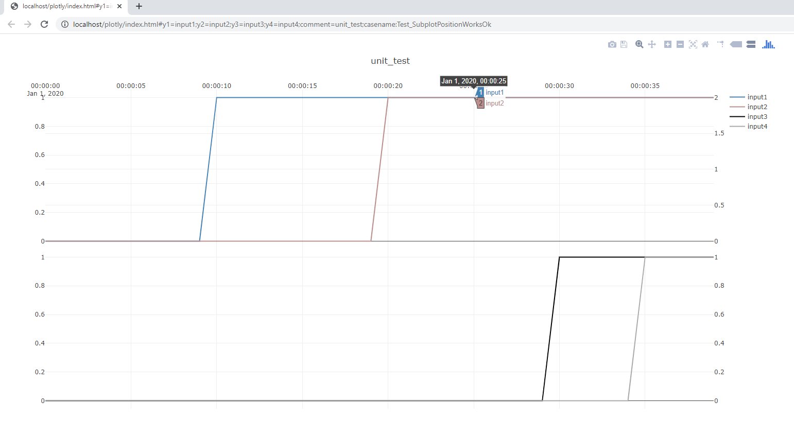

# TimeSeriesAnalysis .NET class library

## At a glance

*TimeSeriesAnalysis* is a .NET class library for making it easy to work with time series in *.NET* framework (written in *C#*). 
It handles typical tasks related to time-series analysis such as
- *loading* time-series data from CSV-files,
- *manipulating* time-series data as arrays and vectors,
- *filtering* out values by range, detecting and removing bad values, smoothing
- *fitting static models* to time-series data by linear regression(based on ``Accord.NET``), 
- *fitting dynamic models* to time-series by custom methods that build on linear regression, and
- *plotting* times-series (in a browser window with ``plot.ly``).
- *dynamic simulation* of systems that may include interatctions with *PID-controllers* (the library includes a reference PID-controller implementation).

**The aim of this library is to make the process of working with time series as easy as possible, 
and the resulting work flow should be comparable to working in *Matlab*, *Python* or *R*.**

This means that you can treat time series as vectors and matrices easily, without worrying about the arrays underneath, and perform 
operations like adding, subtracting, multiplying with vectors and matrices, as well as typical pre-processing tasks like selecting
subsets of a larger dataset, removing spurious values, min/max range limits etc. 

The result is a that tasks that you would normally do in for instance *Matlab* due to the perceived simplicity offered by the language, can now be accomplished in about the same amount of code in *C#/.NET*. 

The benefit of doing this in *C#/.NET* 
- that you get the benefits of a compiled type strict language, by writing your prototype code directly a language suitable for implementation, (unlike a prototype in some script languages). In some cases this may that you can avoid introducing Matlab code generator toolboxes which act as complex black-boxes, and often require expensive licenses. 
- the resulting code does not required a paid license to run.
- you can easily extend your code to for instance run in parallel using the ``paralell.for`` functionality freely available in .NET, wheres this functionality may require a very expensive toolbox in a script language.

> [!Note]
> Originally this code has been written with automation/control-engineering in mind, as control engineers typically 
> prefer compiled languages such as C# for code that is to be *integrated in the control system*. 
> Control systems are usually written in compiled languages in the C/C++/C# family, and the same is also true of other
> enterprise commercial software that deals heavily with time-series, such as dynamic simulators or condition-based monitoring systems. 
>
> This repository could be a toolbox for building **Advanced analytics** tools as part of Industry 4.0

## Plotting capabilities

Plotting supports
- one or two subplots(stacked vertically)
- one or two y-axes on either subplot
- support for zooming in the plot, 
- subplots x-axes are linked when zooming
- ability to turn trends on/off, which will cause auto-zoom to update
- ability to hover over trends to inspect values
- currently up to six trends can be plotted on a page in total(this can be increased if there is interest)

The plotting leverages the JavaScript framework [plot.ly](https://plotly.com/javascript/). Some JavaScript extensions have been made to this toolbox to allow
time-series to seamlessly be exported from your .NET code to the browser.

Consider the unit-test ``PlotUnitTests.SubplotPositionWorksOk()``:

The code below is used to generate four "vectors", arrays of doubles, with a step change in each.
```
public void SubplotPositionWorksOk()
{
   double[] input2 = Vec<double>.Concat(Vec<double>.Fill(0, 20), Vec<double>.Fill(2, 20));
   double[] input1 = Vec<double>.Concat(Vec<double>.Fill(0, 10), Vec<double>.Fill(1, 30));
   double[] input3 = Vec<double>.Concat(Vec<double>.Fill(0, 30), Vec<double>.Fill(1, 10));
   double[] input4 = Vec<double>.Concat(Vec<double>.Fill(0, 35), Vec<double>.Fill(1, 5));

   string plotURL = Plot.FromList(new List<double[]>{ input1,input2,input3,input4},
		new List<string>{ "y1=input1","y2=input2","y3=input3","y4=input4"},1,
		"unit test",new DateTime(2020,1,1, 0,0,0), "Test_SubplotPositionWorksOk");
}
```
> [!Note]
> Note how the ``Vec.Fill()`` an ``Vec.Concat()`` of ``TimeSeriesAnalysis`` package is used in this example to create two vectors of a given
> length and value and concatenate them in a single line of code.

The above code generates the following interactive plot in a Chrome-window(this window pops up automatically):



This plot has two *subplots*(one top, one bottom). Each subplot has both a left and a right axis: 
the top subplot has axes ``y1`` and ``y2`` and the bottom subplot has axes ``y3`` and ``y4``. 

By using the top left menu, it is possible to *zoom* and *drag* the plots, and the two subplots are *linked*,
meaning when you zoom in one of them, the x-axes of the other plot will zoom as well. 
Moving the cursor over each plot allows the values to be browsed by an interactive ``scooter``.

By clicking on the variable names in the *legend* on the top left, it is possible to disable plotting selected variables.

> [!Note]
> Multiple plots will cause Chrome to display them in multiple tabs. A large number of figures can be generated and sorted in this way. 


