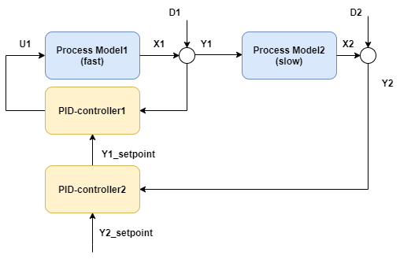
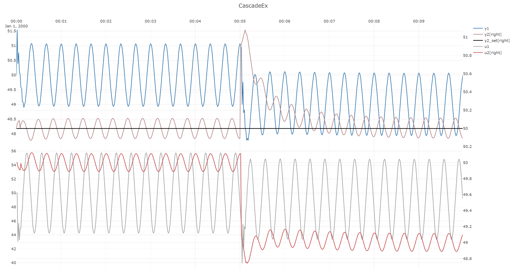
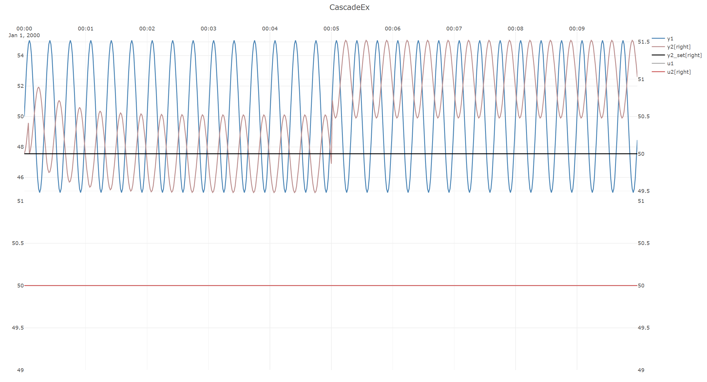

# Cascade control

This example considers a cascade control scheme consisting of a rapid inner loop(``process1`` and ``pid``) 
and a slower outer loop(``process2`` and ``pid2``), both being subjected to simulated disturbances.
(In a real-world case, the inner loop of a cascade is often a (rapid) valve flow-rate controller, 
while the outer loop could for instance be a level that depends on the flow rate.) 



A sinusoidal disturbance ``D1`` is introduced on process1, wheras a step disturbance is introduced halfway through 
the simulation in ``D2``, and the aim is for the cascade controllers to reject both disturbances as well as possible. 

The code to implement the controllers:
[!code-csharp[Example](../Examples/ProcessControl.cs?name=CascadeControl)]

The resulting results.




To observe the open-loop behavior of the system for the same disturbances but with both controllers in **manual mode**, 
comment in the code lines:

```
    pid1.SetManualOutput(50);
    pid1.SetToManualMode();

    pid2.SetManualOutput(50);
    pid2.SetToManualMode();
```

The resulting open-loop simulation results:


These simualtions show the benefits of the cascade control over open-loop:
- transients in ``y2`` of ``+/-0.5``, are reduced to approximiately ``+/-0.1``, and
- the step disturbance in ``y2`` is rejected.

> [!Note]
> There are slight "bumps" in both the open-loop and closed-loop cases above. 
> This is because the simulations by design start in steady-state, whereas for the rest of the simulation the 
> entire process is in never-ending transient state because of the sinusoidal disturbance on ``y1``.
> Thus this bump is unavoidable, therefore in cases such as this, models should only be evaluated after a run-in-time. 


