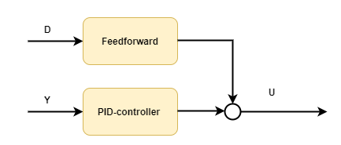

## Feedforward control

. 

## Simulating pid-control against an external disturbance *without* feed-forward 
[!code-csharp[Example](../Examples/ProcessControl.cs?name=Feedforward_Part1)]

## Adding feed-forward to the simulation 

[!code-csharp[Example](../Examples/ProcessControl.cs?name=Feedforward_Part2)]

