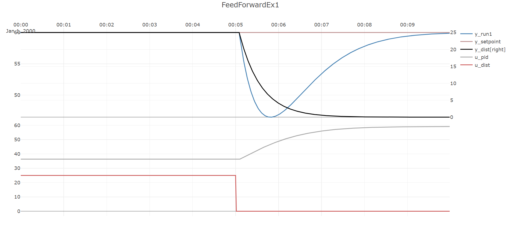

## Feedforward control

. 

## Simulating pid-control against an external disturbance *without* feed-forward 

The first part of this example shows the performance of the process and PID-controller when
a step change occurs in the disturbance signal. 
Note that while the PID-controller is able to stabilize the process, it does create significant 
offset in ``y``, it falls to about ``y=46.5`` at its lowest. 

[!code-csharp[Example](../TimeSeriesAnalysis.Tests/Examples/ProcessControl.cs?name=Feedforward_Part1)]

## Adding feed-forward to the simulation 

In the second part of this example a feed-forward term is added to the PID-controller.
The **input** to the disturbance process is assumed to be measured and is used as the feed-forward variable.
Since this variable moves slightly in advance of the disturbance as seen on ``y``  due to a time delay and time constant, 
a feed-forward from this variable should improve performance. 
As seen, the offset between ``y`` and ``y_set`` is less during the same disturbance step as in the previous part of this example,
with ``y`` falling to just `` y=50.4`` at its lowest, but at the expense of a slight ``overshoot`` in ``y``.

[!code-csharp[Example](../TimeSeriesAnalysis.Tests/Examples/ProcessControl.cs?name=Feedforward_Part2)]

