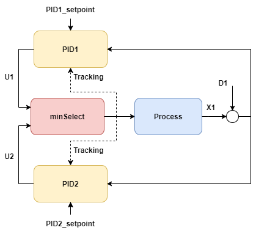

# min/max select and tracking

> [!Note] 
> Work-in-progress, this article is currently a stub.
> Tracking signals need to be added, the treatment of tracking signals inside
> pidcontroller.cs needs to be reviewed, and the how to initialize a system that
> included select-blocks need to be reviewed.

This example considers two controllers who take turns controlling a process through a min-select.
``PID1`` is the controller which is normally active, while ``PID2`` is a more aggressive controller that 
takes over to more aggressively steer the process. 
This type of configuration is reminiscent of how inlet separator levels may be controlled:
- one controller is active during "typical" operation with a low gain to let the level fluctuate and exploit
the buffer capacity of the tank
- another controller is need to take over in case that a very large inlet disturbance (a "slug" of liquid) to avoid filling 
 the tank completely.

The two controllers in this kind of configuration have different *setpoints*, different *integral times* *and* different *gains*. 

The output ``Y`` could for instance be the level in the tank, and the input ``U`` could be the opening of the gas outlet, one strategy to avoid liquid carryover could be to have this valve close more if a slug arrives.

. 

[!code-csharp[Example](../TimeSeriesAnalysis.Tests/Examples/ProcessControl.cs?name=MinSelect)]
