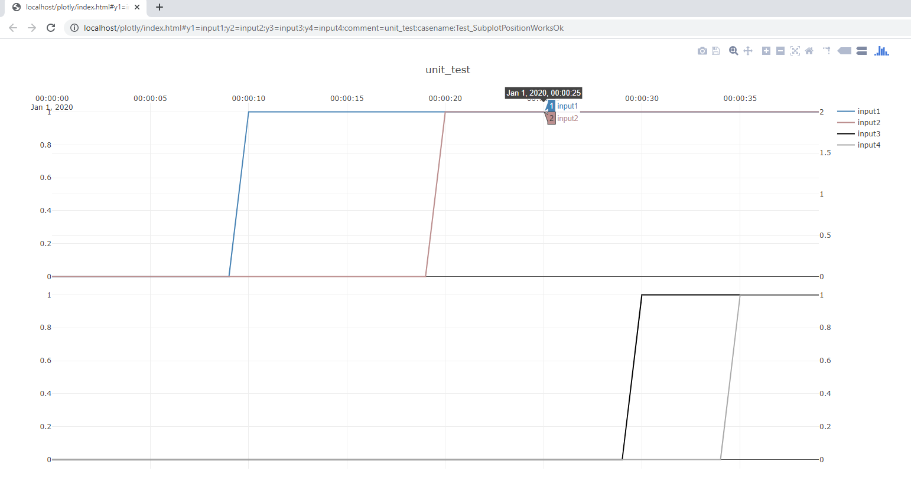

## Plotting capabilities

> [!Note]
> This library is written to support test-driven development(TDD) of algorithms based on time-series, 
> and to support the TDD workflow, it supports time-series plotting. This feature is extremely useful to 
> visualize the results of of unit tests or acceptance tests, and this helps enormously with debugging.
> The unit tests of this repository, give an example of how you can use these plotting capabilities for your own testing.

Plotting features supported
- one or two subplots(stacked vertically)
- one or two y-axes on either subplot
- support for zooming in the plot, 
- subplots x-axes are linked when zooming
- ability to turn trends on/off, which will cause auto-zoom to update
- ability to hover over trends to inspect values
- currently up to six trends can be plotted on a page in total(this can be increased if there is interest)

The plotting leverages the JavaScript framework [plot.ly](https://plotly.com/javascript/). 
Some JavaScript extensions have been made to this toolbox to allow
time-series to seamlessly be exported from your .NET code to the browser.

Consider the unit-test ``PlotUnitTests.SubplotPositionWorksOk()``:

The code below is used to generate four "vectors", arrays of doubles, with a step change in each.
```
public void SubplotPositionWorksOk()
{
   double[] input2 = Vec<double>.Concat(Vec<double>.Fill(0, 20), Vec<double>.Fill(2, 20));
   double[] input1 = Vec<double>.Concat(Vec<double>.Fill(0, 10), Vec<double>.Fill(1, 30));
   double[] input3 = Vec<double>.Concat(Vec<double>.Fill(0, 30), Vec<double>.Fill(1, 10));
   double[] input4 = Vec<double>.Concat(Vec<double>.Fill(0, 35), Vec<double>.Fill(1, 5));

   string plotURL = Plot.FromList(new List<double[]>{ input1,input2,input3,input4},
		new List<string>{ "y1=input1","y2=input2","y3=input3","y4=input4"},1,
		"unit test",new DateTime(2020,1,1, 0,0,0), "Test_SubplotPositionWorksOk");
}
```
> [!Note]
> Note how the ``Vec.Fill()`` an ``Vec.Concat()`` of ``TimeSeriesAnalysis`` package is used in this example to create two vectors of a given
> length and value and concatenate them in a single line of code.

The above code generates the following interactive plot in a Chrome-window(this window pops up automatically):



This plot has two *subplots*(one top, one bottom). Each subplot has both a left and a right axis: 
the top subplot has axes ``y1`` and ``y2`` and the bottom subplot has axes ``y3`` and ``y4``. 

By using the top left menu, it is possible to *zoom* and *drag* the plots, and the two subplots are *linked*,
meaning when you zoom in one of them, the x-axes of the other plot will zoom as well. 
Moving the cursor over each plot allows the values to be browsed by an interactive ``scooter``.

By clicking on the variable names in the *legend* on the top left, it is possible to disable plotting selected variables.

> [!Note]
> Multiple plots will cause Chrome to display them in multiple tabs. A large number of figures can be generated and sorted in this way. 


