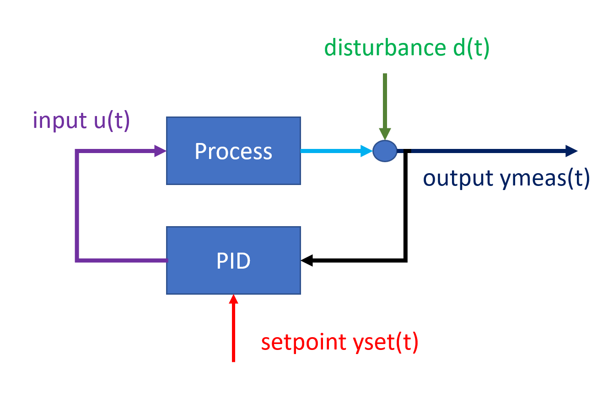
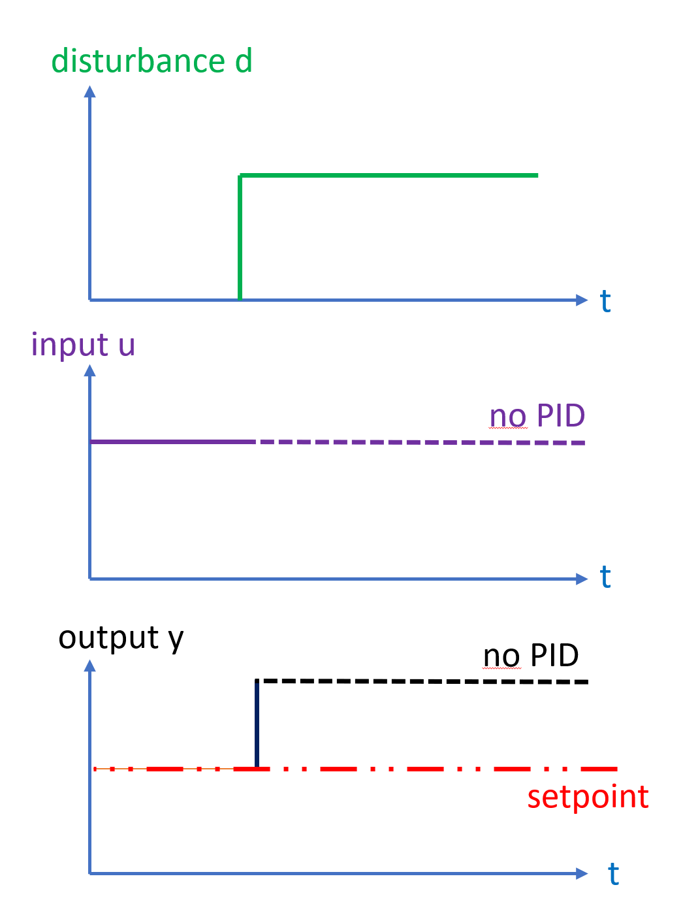
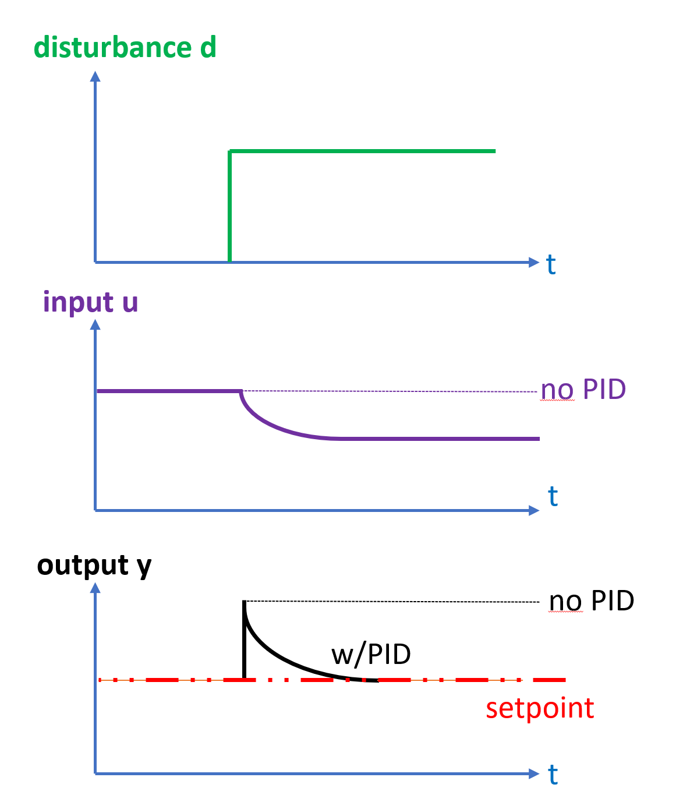
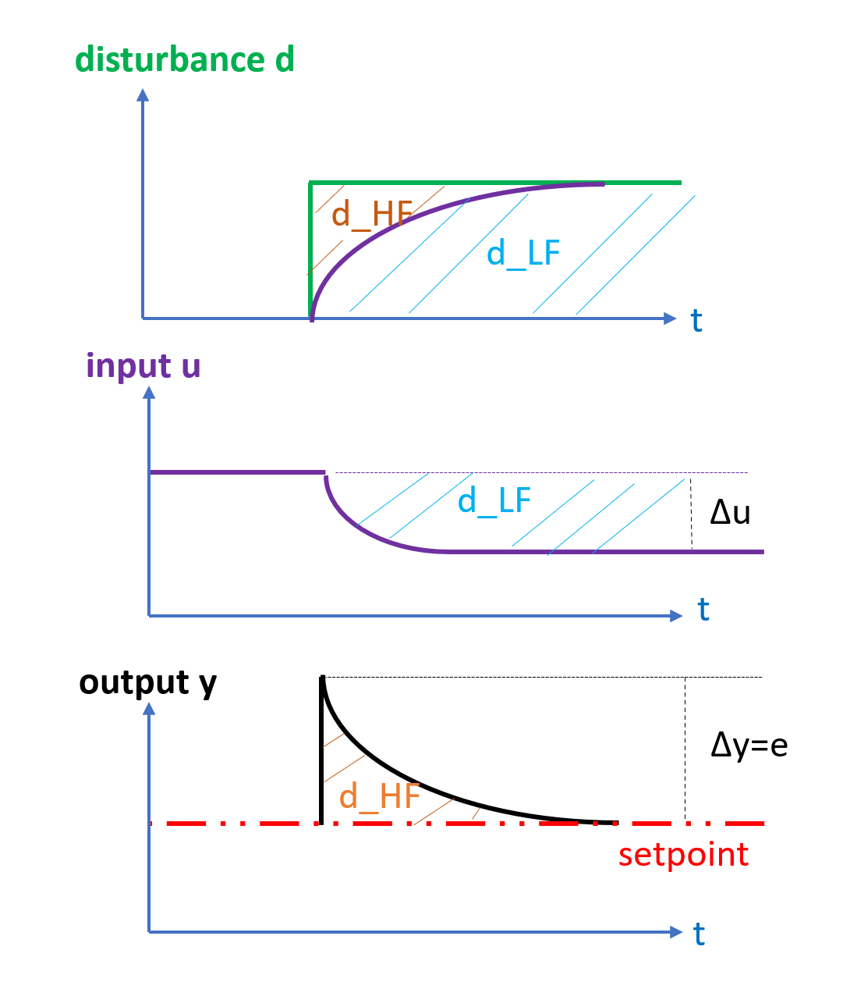
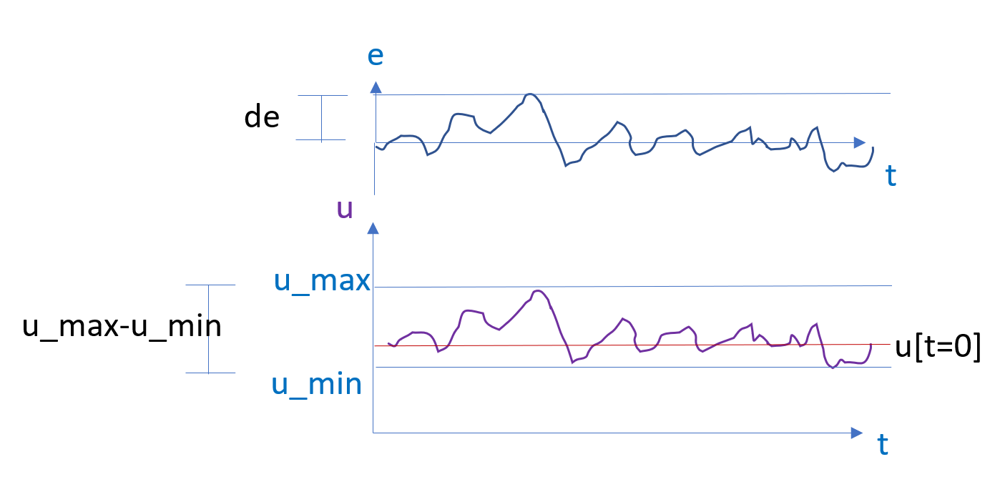

# Closed-loop disturbance signal estimation

## What is it?

The *disturbance* is an additive signal that moves the output of the given unit process.
Counter-acting disturbances are the very reason that feedback controllers are used, they 
observe the deviation between setpoint and measurement of the plant output, and change 
one-or more inputs to counter-act the disturbance. 

 

### Example: step disturbance

Consider a step disturbance acting on a system without feedback

 

The feedback is directly fed through to the output, while the input is constant. 

Now consider and compare the same step disturbance, but this time a PID-controller counter-acts the disturbance

 

The disturbance initally appears on the system output, then is slowly counter-acted by change of the manipulated 
variable ``u`` by feedback control, thus moving the effect of the disturbance from the output ``y`` to the 
manipualted ``u``.

Observing the offset between setpoint and measurement gives a *"high-frequency"* ``d_HF`` response and is seen 
first, while the change in ``u`` is gradual and *"low-frequency"* ``d_LF`` and the approach
will attempt to combine the two as shown below



*The aim of this section is to develop an algorithm to estimate the the un-meausred disturbance ``d``
indirectly based on the measured ``u`` and ``e``*

## Why is distrubance signal estimation important?

Disturbances are the "action" or "excitation" that causes feedback-controlled systems to 
move, if these signals could be estimated, then a disturbance could be "played back" in 
a simulation and different changes to the control system could be assessed and compared.

Describing the disturbance signal is also important for identifying the other components 
of a feedback-controlled system correctly, as disturbances are "non-white" noise that tends
to skew estimates (destroying the regression accuracy) if not accounted for.

## What are the challenges?

The challenge in describing disturbances in feedback-systems is that the feedback aims
 to counter-act the very disturbance which needs to be described by changing the manipulated
 variable.
 
 Thus, the effect of the disturbance is in the short-term seen on the system output ``y``,
 but in the long-term the effects of the disturbance are seen on the feedback-manipulated variable
 ``u``. The PID-controller will act with some time-constant on ``u``,and this change in ``u``
 will again act back on the output ``y`` with a delay or dynamic behavior that is 
 given by the process(described by the process model.) To know what amplitude a disturbance has,
 requires knowledge of how much effect (or "gain") the change in manipulated variable u will 
 have caused on the output ``y``.
 
*Thus the two tasks of estimating the disturbance and estimating the process model are linked*,
and thus they likely need to be solved *jointly*.
 
## Approach 

The chosen approach to solve the linked problem of solving for 
process model and disturbance signal is *sequential*(as opposed to simultaneous),
 meaning that the algorithm first estimates a disturbance signal, then 
what process model best describes the data for the given disturbance signal, then the estimate
of the disturbance is updated using the model, back-and-forth until both estimates hopefully converge.

Let the control deviation ``e`` be defined as
```
e = (y_meas-y_set)
```

Further, the disturbance is divided into a high-frequency part ``d_HF``
and a low-frequency part ``d_LF``,
and it is assumed that 
```
d = d_HF+d_LF = d_HF(e)+ d_LF(u)
```
``d_LF`` will in general also be a function of the process model, especially the process gain.

### Guessing the sign of the process gain

Time-series from closed loop systems excited by un-measured external disturbances may sometimes exhibit 
unexpected process gain from ``u`` to ``y``.

For instance, you may see ``y`` and ``u`` both rise in unison and assume that process gain is positive, 
yet you may be wrong because ``y`` may be rising due to an un-measured positive disturbance signal on y, and the 
PID-controller may be increasing ``u`` in order to bring ``y`` back down to the setpoint.

For this reason, closed loop estimation starts by guessing the sign of the process gain, and this is done by 
looking at the average values of ``u`` when ``e`` is below and above zero. It is assumed that if ``u`` is generally 
set higher by PID-control when ``e`` is positive than when it is negative, that process gain is negative, and in the 
opposite case process gain is assumed positive.

### First, model-free estimate

In order to initialize the sequential estimation, a model-free estimate of the disturbance
is require initially. 

For the first iteration, all process dynamics and nonlinearities are neglected, 
a linear static model essentially boils down to estimating the process gain. 

 

This first estimate of the process gain ``G`` in a linear model ``y = G x u``
is found by the approximation 
```
G = max(e)/(max(u)-min(u)) 
```

### Separating the state of the system from the output

Let the state ``X`` be defined as the output minus the disturbance:
```
y = x + d
```
When solving the process model for a given disturbance, the identification is 
done on the un-measured ``x`` found from 
```
x = y-d
```

### Determing the dynamic parameters of the process 

*This is currently a work in progress.*

If the process is actually dynamic yet is modeled as static, then the above methodology will 
result into un-modeled transients bleeding into the estimated disturbance, where they will appear as 
"overshoots" 2.order dynamics in the estimated disturbance.

If every change in ``e`` is followed by similar transient in ``d`` then this is a sure sign that there is un-modeled dynamics,
if these "transients" can be described by adding dynamic terms to models and this causes a "flatter" estimated disturbance,
then this is usually preferable. 

These un-modeled transients may also cause process gains and disturbance estimates to be skewed slightly too large.

In the final step, the ClosedLoopEstimator tries to modify the static models identifier previously by adding larger and larger
time constants to the identified model, and observing if this reduces the *absolute, sample-over-sample variance in the disturbance".


### Algorithm
```
(In the case of no setpoint changes in the data set)
- Guess the process gain, as shown above
- Disturbance("run1"):Estimate the disturbance for the linear static process gain
- Model("run1"):Subtract the above disturbance signal from y, and run UnitIdentifier.IdentifyLinearAndStatic to estimate
- Disturbance("run2"):Estimate the disturbance using the above process model 
- Model("run2"): Subtract the above disturbance signal from y, and run UnitIdentifier.Linear
- Disturbance("run3"):Estimate the disturbance using the above process model 
- Model("run3"): Subtract the above disturbance signal from y, and run UnitIdentifier.Linear
- Disturbance("run4"):Estimate the disturbance when different time-constants are added to the model of run3, choose
the model which gives the disturbance with the least absolute sample-over-sample variance
```


