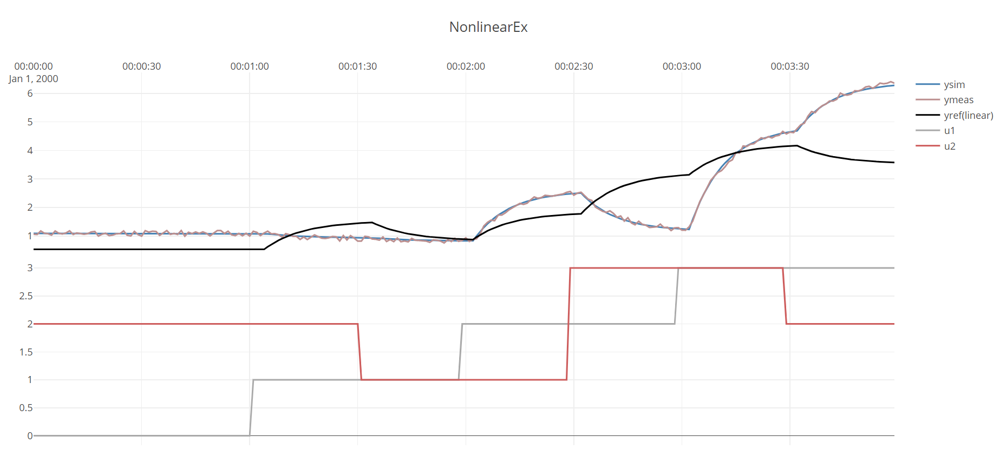

[!code-csharp[Examples](../Examples/SystemIdent.cs?name=ex_NONLINEAR_UNIT_MODEL)]

The resulting figure




The output of ``idModel.ToString()`` gives details on the model:
```
DefaultProcessModel
-------------------------
ABLE to identify
TimeConstant : 9,22 sec ± 3,5
TimeDelay : 4 sec
ProcessGains(at u0) : 
	1,97 ± 1,6
	-0,0525 ± 0,96
 -> Linear Gain : 
	0,998 ± 1,4
	0,77 ± 0,92
 -> Curvature Gain : 
	0,961 ± 0,026
	-0,821 ± 0,021
 -> u0 : [1.1;1.1]
 -> uNorm : [1;1]
Bias : 0,997 ± 1,3
```

