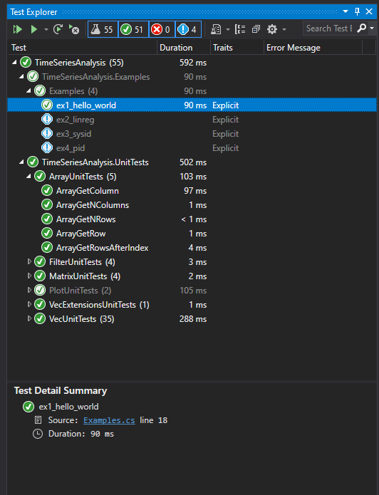
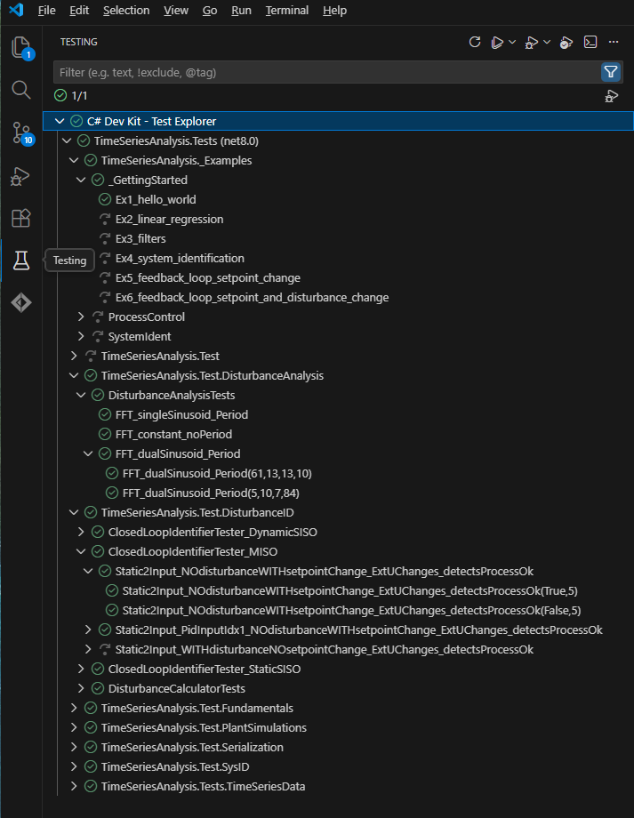

## Setting up and running unit tests 

> [!Note]
> Unit tests are an important part of the documenting this class library, as they give examples of how to run the public interface of the library, and document 
> the expected output. Thus, unit tests are worth studying even for users who do not intend to write or modify unit tests.

Unit tests are implemented using NUnit 3.

> [!Note]
> Note that some tests related to plotting are ``Explicit``, and will need be run one-by-one. This has been done this way as this tests require manual inspection, and to avoid
> drowning the user in plots when re-running unit tests. 

## Visual Studio

In ``Visual Studio`` you should be able to browse the unit tests in the window ``Tests>>Test Explorer``. In the ``Test Explorer`` window, pressing ``Run All tests`` should cause
all tests to turn ``green``. 

In some cases, it may be that the tests appear grayed or or with a blue exclamation point beside them. That indicate an issue with the installation of the ``Nunit3TestAdapter`` 
package through NuGet, which is required for integration NUnit with Visual Studio. 

##  VS Code

VS code should be able to recognize the unit tests as long as the ``#C# Dev Kit`` is installed, and should look similar to below:

	