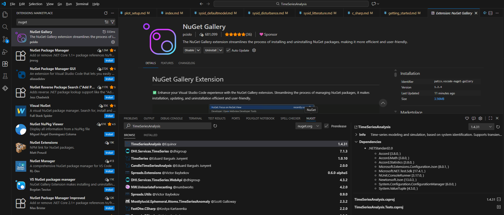

The easiest way to get started with the library is to work in C#, either in Visual Studio or VS Code. 

THere are two ways to work with the library
- use/reference the library methods "as is", in which case you can use ``NuGet`` to import the pre-built library into for example a console application. 
- fork the library from GitHub and modify the library or examine and run the unit-tests

## VS Code
- you need to set up VS Code to work with C# and .NET if you haven't already, add the following extensions:
    - .NET Extension Pack (Microsoft)
    - .NET Install Tool(Microsoft)
    - C# (Microsoft)
    - C# Dev Kit (Microsoft)
- in addition, if you want to import the pre-built application from nuget, you can do so from the command line, or install a third-party NuGet browser
    - for instance you can use Nuget Gallery (pcislo)

You may need to install an .NET SDK from ``https://dotnet.microsoft.com/`` but this should be handled automatically by `` .NET Install Tool``.

Below is a screenshot of Nuget Gallery where a search has been performed for "TimeSeriesAnalysis"

## Visual Studio

Perhaps the easiest way to get started is to work in C# in Visual Studio:
- make sure Visual Studio is installed with .NET support
- find the package on NuGet and download into your application (Nuget is built in to Visual Studio)

## Setting up an empty c# project
- create a new solution, with one exectutable project, for instance a ``console application``.
- make sure the reference to the TimeSeriesAnalysis library is added to your solution (for instance through NuGet)
- import the name spaces : ``import TimeSeriesAnalysis`` in you C# header
- start calling methods from the API.
- when building your code, other dependencies like ``Accord.NET`` are downloaded automatically by NuGet.

