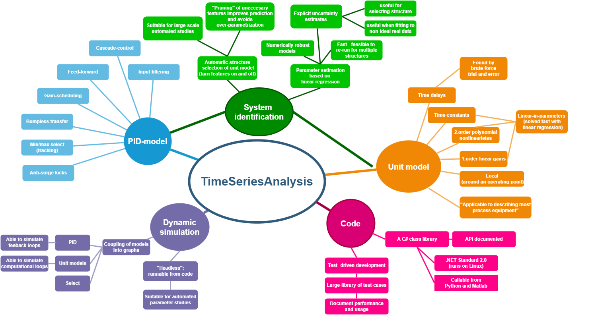

# TimeSeriesAnalysis 

------------------------------------------------------------------
 **Source code**   https://github.com/equinor/timeseriesanalysis     

 **Releases**      https://github.com/equinor/TimeSeriesAnalysis/releases 

 **Documentation**  https://equinor.github.io/TimeSeriesAnalysis  

------------------------------------------------------------------

## At a glance

**An open-source library of methods to identify, simulate and control industrial process plants, 
built on .NET Standard 2.0.**

The most significant contributions of the library are:
1. an (open-loop) **unit model and -identification algorithm** that can describe both stationary and dynamic, linear and weakly nonlinear processes, and an algorithm to automatically choose the best model for a given input.
2. a **closed-loop identification algorithm** that can estimate processes and disturbances from closed loop time-series.
3. a **PID-controller identification algorithm** that can estimate gain and integral time by observing the output of a controller.,
4. a **state-of-the-art advanced industrial PID-controller model** implemented as a *unit-model*, and 
5. a **dynamic plant simulator** that is able to simulate connected *combinations of unit models*("plant models"), each unit-model may be an identified PID-controller or an identified model.

The main value proposition of the library is that
1. it collects many years combined industrial and academic experience into one a package of tools that are *all integrated/compatible with each other* ,
2. it aims to acts as a *reference implementation* for vendors and researchers,
3. it aims to be *suitable for industrial implementation*, code-base should be robust and well-tested, all edge-cases should be handled gracefully, and
4. it opens the possibility to *automate modeling and simulation* of plant models. This enables *advanced analytics* or *data-mining*, which by most definitions are automated
or semi-automated.
 
> [!Note]
> The primary use-case for this library is for **industrial automation**, thus
> the emphasis on modeling PID-controllers and on time-series models that are able
> to describe the dynamics of typical industrial plants. The methods themselves are 
> general and it is feasible to apply these methods to other types of datasets.

The intention is to be able to easily code **"plant simulators"** by connecting  
**"grey box"** unit models. The intention is to make the process of identifying unit models, 
connecting models and simulating as easy as possible, and to automate wherever possible. 

Because the code is written as a .NET Standard class library, it is equally possible 
to run the library in the cloud on a Linux instance, to call the library for development
on your desktop through Python or Matlab, or to integrate the library into "edge" computing
in industrial control. 

## Motivation - "grey-box" rather than "black box" 

> [!Note]
> **A grey-box model** is built to have parameters fitted 
> to time-series data (like black-box models), but at the same time each parameter has an
> intuitive phyiscal interpretation (like a white-box model).

Grey-box models attempt a "best of both worlds" compromise 
between "white box" models (where paramters are set using prior knowlege)
and "black-box" models (where parameters are determined by fitting and have no direct physical interpretation.)

The aim is to make models that can represent large and complex plants, yet where the meaning of 
each parameter in each unit models is still intuitive, 
representing some intuitive physical property like for instance *"gain"*,*"time delay"* or *"time constant"*.
Grey-box models have two very interesting properties:
- parameters of automatically identified models can be *inspected* by users to *gain insight*, and also
- users can *add insight* by *changing* parameters where needed. 

Grey-box modeling may have an advantage when fitting to data that has some, but less than 
the ideal amount of information, which is a typical scenario for "as-is" real-world industrial 
process data. In such a scenario, it is possible to fill in gaps in the model
using a priori knowledge since parameters have a physical interpretation. 

### Advanced analytics

Advanced analytics is [defined](https://www.gartner.com/en/information-technology/glossary/advanced-analytics) as :

*" the autonomous or semi-autonomous examination
 of data or content using sophisticated techniques and tools, typically beyond those of 
 traditional business intelligence (BI), to discover deeper insights, make predictions, 
 or generate recommendations."*

Note that advanced analytics by definition **requires** **automated** or **semi-automated**
 analysis to generate recommendations, 
thus it needs to be *"data-driven"*.

A success criterion for any *data driven* method will be its **reliability**, so that despite
little manual configuration and assistance, methods should consistently provide **dependable** high-quality
output. To create reliable and dependable software, complete control of the entire software stack is 
advantageous as: 
- solutions are easier to integrate and deploy (be it on-premise, on your local computer, integrated into
vendor software, or running in the cloud), and
- the quality, behavior and performance of each component can be inspected and, if need be, improved,i.e. there
are no code "black boxes".

An advantage of an open software stack is that it can create industrial collaboration, and industrial/academic
collaboration that can hopefully raise the quality of software by pooling resources.

