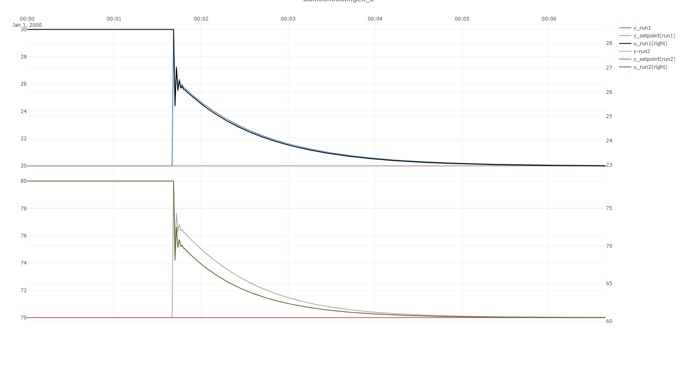

# Gain-scheduling a nonlinear process

This example considers a system that is nonlinear, and illustrates how to apply and simulate
gain-scheduling for such a system.

> [!Note]
> This example considers gain-scheduling only in ``Kp``, but ``PIDModel`` also supports gain scheduling
> in ``Ti``.

## Simulating step responses of the open-loop system

The system considered is given a *negative curvature*, meaning that the gain will decrease with increasing values of 
``u``.

Firstly, the system is defined and the two simulation runs are done, one run at a low value of input, where the 
gain is *high*, and a second at a high value of the input, where the gain is *low*.

[!code-csharp[Example](../../TimeSeriesAnalysis.Tests/Examples/ProcessControl.cs?name=GainScheduling_Part1)]

The resulting plot is shown below:

## Simulating the use of two standard PID-controllers
[!code-csharp[Example](../../TimeSeriesAnalysis.Tests/Examples/ProcessControl.cs?name=GainScheduling_Part2)]

The resulting plot is shown below:

> [!Note]
> In order to get an approximately equally rapid disturbance rejection at setpoint ``y=70``
> as for ``y=20``, ``Kp`` had to be increased from ``0.3`` to ``1 ``, so by about a factor of three.
> It would be quite hard to find a single PID-controller tuning that would work equally well across
> the entire span of possible outputs ``y``. Thus a gain-scheduled controller could be useful here.

## Combining the two controllers into a single gain-scheduled controller

In the final part of this example, a gain-scheduling controller that performs equally well for both 
cases is created.

The code to create the gain-scheduling controller and simulate both runs:
[!code-csharp[Example](../../TimeSeriesAnalysis.Tests/Examples/ProcessControl.cs?name=GainScheduling_Part3)]

The resulting plot is shown below:

> [!Note]
> Notice how in the final plot, the gain-scheduling controller combines the control performance 
> of **both controllers** in the above parts of the example **in a single controller**.

