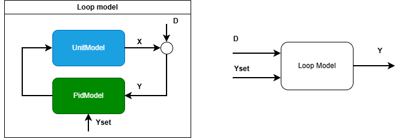
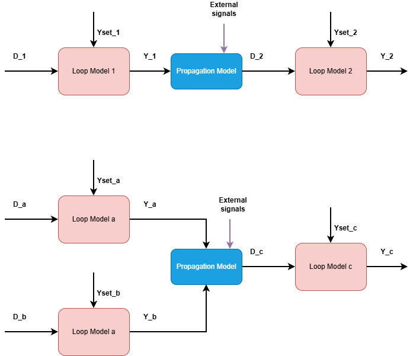

# Disturbance-driven plant modeling

To apply the identification and simulation methods of this library to real-world processes, which 
may consist of equipment such as valves, compressors, heat-exchangers, may require 
some context-specific adaptations. 

## Plant modeling: General considerations 

To apply the methods of this library to modeling larger plant, there are several techniques that need to be employed:
- *regressor / input transformations* :capturing non-linearities by transforming inputs, for instance by raising the input to a power
- *choice of inputs*: the choice of which input or inputs to use in modeling to predict each output is a design choice, and these choices will have implications 

What design choices are made during modeling may depend on the intended purpose of the model. 

Use-cases can be broadly separated into
- *"condition monitoring"* : the model is only intended to run concurrently with a given dataset
- *"what-if" simulations*: the model is intended to be used to evaluate different hypothetical scenarios that don't match the given data(i.e. some variables are *free variables*).

### Boundary conditions

The choice of input to models is a design decision, as when an input is included it must either be supplied to the simulation, or further models may need to be added to relate this input
to other boundary conditions.

For example, the flow through a choke can be described using the choke opening $z$ alone, but most choke equations include both the choke opening $z$ and the differential pressure $\sqrt(\Delta p)$ 

For condition monitoring, any available time-series can be used as boundary conditions for the model, but for a what-if simulation, *only boundary variables that are independent 
of the free variables* should be included.

> [!NOTE]
>**Example**
> Most physical equations for mass through a choke are of the form $\dot{m} = f(z,\Delta p)$. 
> For *condition monitoring* it makes sense to feed $\Delta p$ time-series as a boundary condition into this equation along with $z$ to estimate a mass flow. 
> However, this choice of input is problematic for  *what-if simulations*, as the differential pressure depends on the choke opening, and so to allow the choke opening to 
> vary freely, one would need to model how $\Delta p$ changes with $z$ as well ($\Delta p = g(z)$), in effect turning $\dot{m} = f(z,\Delta p) =  f(z,g(z)) = h(z)$. 

### Mass flow 

Especially for oil and gas the feed rate is usually not directly measured, but can only be inferred from downstream measurements after separation. 

This represents a challenge for what-if simulation, as many physical quantities in a process plant will depend on the mass rate:
- the pressure drop over pipes
- the pressure drop over chokes
- the heat transfer in heat exchangers
- the pressure rise over a compressor

Introducing mass rates into a plant model also causes a dilemma for the designer, as mass conservation requires adding algebraic equations to the a solver, which rules out explicit solvers and results 
in longer computational times. 

## Disturbance-driven modeling

### Single-loop disturbance-driven modeling (DDM)

A PID-loop consisting of a unit model and a PID will be referred to as a *"loop model"*. These models have a very interesting property:

**The only two boundary conditions of a loop model are the setpoint and the disturbance signals**, as illustrated below:

For many loops, the setpoint is either a constant  or is itself the determined by another loop model in cascade control.
Then the only boundary condition that needs to be modeled is the disturbance signal. The disturbance signal can be determined once the process variable 
measurement ``Y`` and the output of the PID ``U`` are known, and if a process model is assumed that relates ``U`` to ``X``, 
then ``D = Y- X``.

Importantly, the disturbance signal is considered an upstream boundary condition to the loop, it is an external signal that is invariant to the implementation of the PID-loop, 
such as the tuning of the PID-controller.

A "loop model" as defined above is capable of "what-if" simulations given the above assumptions. In these "what-if" simulations, the disturbance signal ``D`` 
is first determined by the given input signals ``Yset``, ``Y`` and ``U`` and the assumed process model. Then this disturbance signal is can	be used to simulate what-if scenarios
where either the setpoint takes a different trajectory, or a different version of the PID model is used (such as different tuning.)

> [!NOTE]
>**Setpoint-driven modeling**
> Traditionally, loops are determined by varying the *setpoint* and the disturbance is considered negligible, sometimes experiments are performed on the process at rest.
> This is a valid approach, but the drawback is that such a tuning campaign is not always possible, it disturbs normal operation and thus comes with a significant costs, and
> it also has a certain risk of causing a triggering the safety systems automatic shutdown.

### Multi-loop disturbance-driven modeling 

In process systems, equipment is connected with downstream equipment, and especially in oil and gas, the main disturbance is the actual feed at the very upstream boundary.
The feed disturbance propagates through multiple loops, that collaborate to even out the disturbance, using buffer capacities of different capacity and also the travel time between equipment.  
There is generally no measurement at the feed inlet, so the initial disturbance is unmeasured, but is observed indirectly by its consequences through the processing train. 

Based on the problem description, it would be desirable if the single-loop disturbance driven modeling approach above could be extended to analyze multiple loops together.

In general, simulating the propagation of disturbances across multiple loops would require "*propagation models*" that link process values of upstream loops with the disturbances of downstream loops,
as shown below

> [!NOTE]
>**Propagation models**
> - the choice of propagation model inputs is a design choice that *should* be informed by the topology of the process plant
> - propagation models *should* ideally link to the measured process values of upstream loops
> - propagation models *could* also include external non-loop signals as inputs(if necessary), but remember that for what-if simulations these inputs will need to be frozen, or they must themselves be modelled. 
> - propagation models can link to *one* or *multiple* upstream loops 
> - propagation models could be modeled using single or multiple ``UnitModel`` models, in which case parameters can be determined used ``UnitIdentifier``.
> - propagation models will likely need to include transport delay. 

