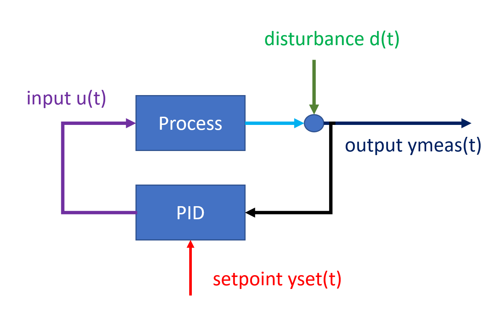
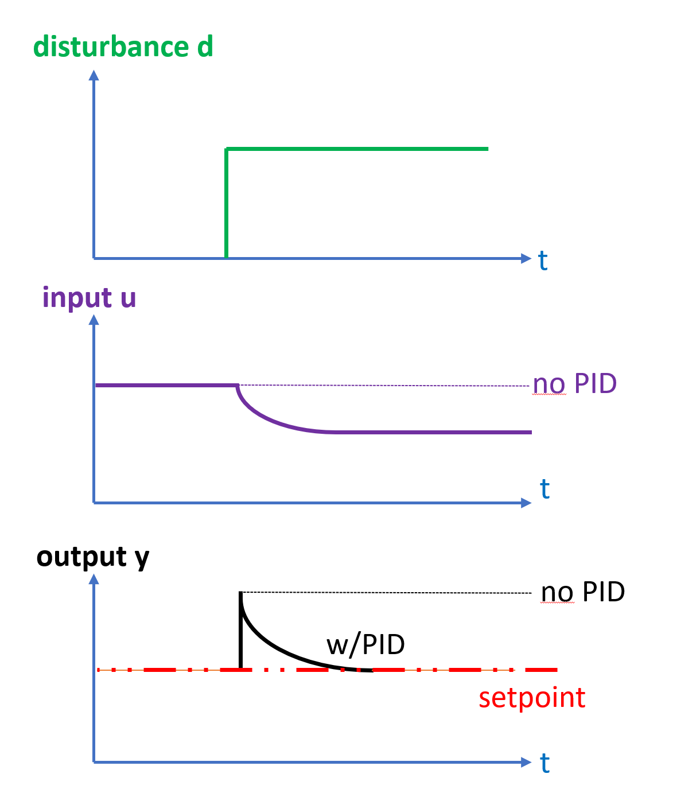
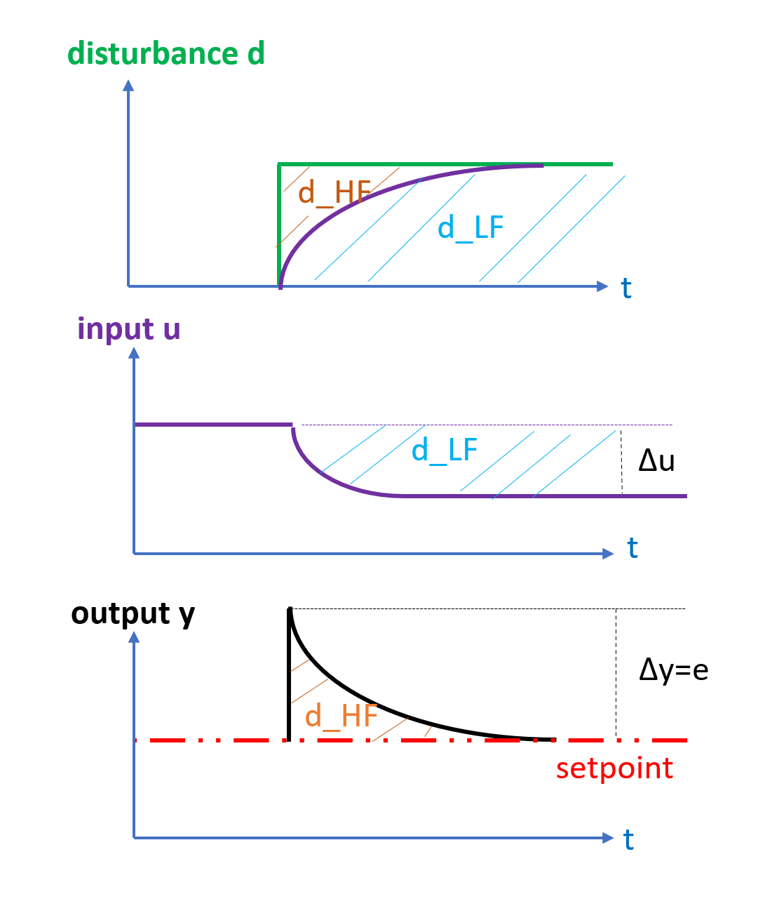
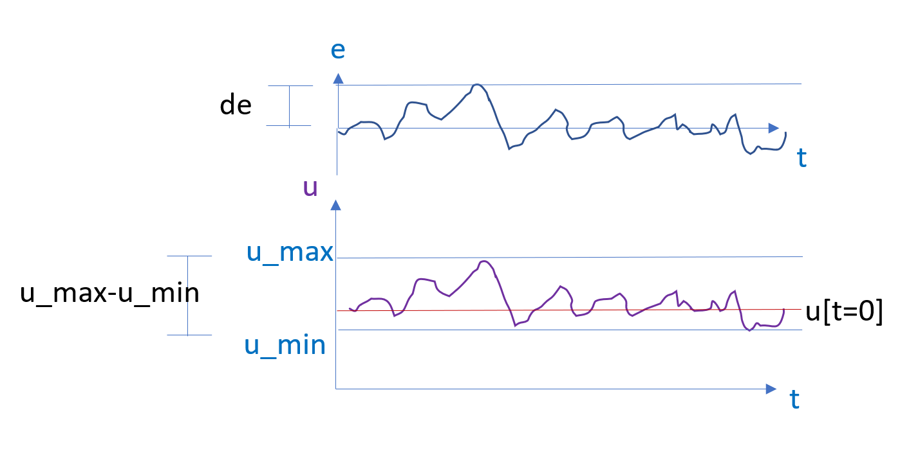

# Closed-loop disturbance signal estimation

## Definitions and motivating example

The *disturbance* is an additive signal that moves the output of the given unit process.
Counter-acting disturbances are the very reason that feedback controllers are used, they 
observe the deviation between setpoint and measurement of the plant output, and change 
one-or more inputs to counter-act the disturbance. 

Consider a step disturbance acting on a process *without* feedback

The feedback is directly fed through to the output, while the input is constant. 

Now consider and compare the same step disturbance, but this time a PID-controller counter-acts the disturbance:

The disturbance initially appears on the process output, then is iteratively with time counter-acted by change of the manipulated 
variable $u$ by feedback control, thus moving the effect of the disturbance from the output $y$ to the 
manipulated $u$.

Observing the offset between setpoint and measurement gives a *"high-frequency"* $d_{HF}$ response and is seen 
first, while the change in $u$ is gradual and *"low-frequency"* $d_{LF}$ and the approach
will attempt to combine the two as shown below

*The aim of this section is to develop an algorithm to estimate the the un-measured disturbance $d$
indirectly based on the measured $u$ and $e$*

> [!Note]
>**Why is disturbance signal estimation important?**
>
>Disturbances are the "action" or "excitation" that causes feedback-controlled systems to 
>move, if these signals could be estimated, then a disturbance could be "played back" in 
>a simulation and different changes to the control system could be assessed and compared.
>
>Describing the disturbance signal is also important for identifying the other components 
>of a feedback-controlled system correctly, as disturbances are "non-white" noise that tends
>to skew estimates (destroying the regression accuracy) if not accounted for.

The measurement $y_{meas}$ shows us the combination of the disturbance $d$ and the process output $y_{proc}$

$$y_{meas}[k] = y_{proc}(u[k-1]) +d[k] $$

Note the above convention for $y_{proc}$, $d$ and $y_{meas}$ are consistent with the convention used by ``PlantSimulator``. 
This is important, as the ``PlantSimulator`` is used in the estimation of disturbances. 

If a model of the process can be determine that is close to the actual process output

$$y_{process} = y_{mod}(u(t)) $$

then an estimate of the disturbance is given by

$$d_{est}(t) = y_{meas}(t) - y_{mod}(u(t)) $$

Further, the disturbance is divided into
-a high-frequency part $d_{HF}$ that depends on $e(t)$, and 
- a low-frequency part $d_{LF}$ that depends on $u(t)$
and it is assumed that 
$$
d = d_{HF}+d_{LF} = d_{HF}(e)+ d_{LF}(u)
$$

> [!Note]
>
> $d_{LF}$ will depend on the process model, and especially the process gain.
>

Let the control deviation $e$ be defined as
$$
e = (y_{meas}-y_{set})
$$

By $$y_{meas} = y_{mod}(u) + d$$, where $$y_{internal}(u)$$ is the response of the process

it stands to reason that once the a model $y_{mod}(u)$ is assumed, the disturbance vector can be calculated
by subtracting the effect of the model from the measured $y_{meas}$:

$$d_{est}(t) = y_{meas}(t) - y_{mod}(u(t)) $$

### What are the challenges?

The challenge in describing disturbances in feedback-systems is that the feedback aims
 to counter-act the very disturbance which needs to be described by changing the manipulated
 variable.
 
 Thus, the effect of the disturbance is in the short-term seen on the system output $y$,
 but in the long-term the effects of the disturbance are seen on the feedback-manipulated variable
 $u$. The PID-controller will act with some time-constant on $u$,and this change in $u$
 will again act back on the output $y$ with a delay or dynamic behavior that is 
 given by the process(described by the process model.) To know what amplitude a disturbance has,
 requires knowledge of how much effect (or "gain") the change in manipulated variable u will 
 have caused on the output $y$.

In most cases only a single $u(t)$ is considered, and this is the pid-output $u=u_{pid}(k)$.

> [!Note]
> in general it is hard to know if the observed closed-loop behavior $y_{meas}$,$u_{pid}$ 
> is due to a process with large process gain and the $u_{pid}$ responding to large disturbances
> or if the pid-controller is reacting to small disturbances for a process with small gains. 

Observations
- Note that $y_{proc}$` is not directly observable unless the disturbance is zero.
- $y_{proc}$ depends on one or more inputs u(t) that are measured. 
- one of the inputs to the $y_{proc}$ is the output of the pid-controller, which looks at $y_{meas}$ 
and tries to counter-act disturbances that enter, thus $y_{proc}$ and $d(t)$ will be covariant.
 

> [!Note]
> If the process model were known in a closed feedback loop, then the disturbance is also known 
> because the influence of the process on the measured output $y_{meas}$ could be subtracted
> to determine $d$. 

> [!Note]
> *The two tasks of estimating the disturbance and estimating the process model are linked*:
> *if you have solved one, you > have solved the other.*
 
It is in general much easier to determine the gain of the process if there is **"external excitation"** either
- the pid-controller is set in manual mode and a step change is performed, or
- a setpoint step or some other setpoint change is applied to the pid-controller, or
- (if the process is multiple-input, single-output (MISO), then applying changes to the other inputs also appears to improve the estimate of the process gain)

**The aim of this algorithm is to give a sensible estimate of the process gain/disturbance even in cases where there is 
no introduced excitation.** In some cases it will be impossible to determine a unique process gain, but in such cases it would be 
useful if instead the method returned a range of possible values. 

> [!Note]
> **Tools for estimating closed-loop**
>
> The tools at our disposal are:
> - It can be assumed that a dynamic model of the PID-controller is available (``PidModel``) 
> - The ability to do both open-loop simulations of the ``UnitModel`` using ``PlantSimulator``
> - The ability to do closed-loop simulations of the ``UnitModel`` and ``PidModel`` together using ``PlantSimulator``
>
> Based on these tools:
> - it will be possible to due a large number of very **computationally inexpensive dynamic simulations** over a given dataset 
> for different parameters choices, so **"trial-and-error" global search for parameters** is feasible
> - it is possible to **create synthetic datasets** using the above methods where the "true" values will be known, and these datasets could
be combined with the methods of automatic unit testing to ensure that the method works as expected.

## Approach 

The chosen approach to solve the linked problem of solving for 
process gain and process time constant is **sequential** (as opposed to simultaneous).

This algorithm is implemented in the class ``ClosedLoopUnitIdentifier``, as follows:

given an estimate of the PidModel from prior knowledge or from ``PidIdnentifier``:
- **choose indices to ignore (bad or frozen portions of data)**
- **use a heuristic to get an initial static "model-free" guess for the process model (process gain and -sign) (``step0``)**
- set heuristic broad search range for the process gain $[G_{min},G_{max}]$
- one "pass" 
	1. **taking the best current guess of process time-constant, estimate the process gain by a global search between $[G_{min},G_{max}]$ (``step1``)**
	2. **taking the best process gain from step1, estimate the process time-constant(``step2``)** 
	- (try to improve the model by testing time-delays)(not implemented)
	3. **reduce the range of $[G_{min},G_{max}]$** around the value found in step 1 and do another pass, or exit 

> [!Note]
> **Convergence**
> 
> - It has been found that doing 2 passes is usually sufficient to converge. 	
> - There is no sense doing a second pass if the steps 1 and 2 did not cause any change in parameters (in which case only one pass is done)
> - In general there is no guarantee that a sequential optimization will converge, but the method usually does so in practice if information exists in
> the data set

This algorithm is implemented in the class ``ClosedLoopUnitIdentifier``.

A number of test scenarios are simulated and used to benchmark the algorithm in the unit test library:

- step disturbances
- random walk disturbances
- sinusoidal disturbances
- sinusoidal disturbances and a setpoint step change
- step disturbance and setpoint step change

> [!Note]
> **Outstanding issues of ``ClosedLoopUnitIdentifier``**
> - the method does not use the supplied ``FittingSpecs`` to select indices to be ignored based on user-supplied minimum or maximums in inputs or outputs.
> - the outlined final step of refining the identified model to also determine a time-delay is not implemented

### Step 0
##### The first, model-free estimate of the process gain

The idea of the initial estimate gain is to get an idea of the approximate value of the process gain, which will 
determine the bounds for global search in subsequent steps. 

A model-free estimate of the disturbance is required to initialize
subsequent sequential estimation. 

For the first iteration, all process dynamics and non-linearities are neglected, 
a linear static model essentially boils down to estimating the process gain. 

This first estimate of the process gain $G_0$ in a linear model $y = G_0 x u$
is found by the approximation 
$$
G_0 = \frac{\max(e)}{\max(u)-\min(u)}  
$$

The PID-controller integral effect time constant meant that a peak in the deviation $e$ will not coincide with the peak
in $u$.
The idea of creating an initial estimate with ``min`` and ``max`` values is that it circumvents the lack 
of knowledge of the dynamics at this early stage of estimation. 

Given the gain an initial ``UnitModel`` is created with a rudimentary bias and operating point $u_0$, so that the model can 
be simulated to give an initial $y_{mod}(u)$, so that an estimate $d_{est}(t)$ can be found.

> [!Note!]
> **Step 0 dynamic artifacts in the estimated disturbance**
> 
>Because no process dynamics are assumed yet, $d_{est}(t)$ at this stage will include some transient artifacts if the process
>has dynamics. $d_{est}(t)$ will be attempted improved in subsequent steps.
>
>It has been observed in unit tests that this estimate in some cases is spot on the actual gain, such as when 
>the disturbance is a perfect step.
>
>It seems that the accuracy of this initial estimate may depend on how much the process is close to steady-state for different disturbance values, 
>as disturbance step produces far better gain estimates than if the disturbance is a steady sinus(so that the system never reaches steady-state.)

### The accumulated traveled distance of a signal 

The ``accumulated traveled travel`` $Q$ of a signal we defined as :
$$
Q(x) = \sum_{t=0}^{N-1} |x[k+1]-x[t]| 
$$

This metric is used extensively in the below algorithm.

##### Step 0: Guessing the sign of the process gain

Methods for open-loop estimation when applied naively to closed loop
time-series often estimate process gain with incorrect sign. 

The reason for this is that cause-and-effect relationships are different 
in closed- and open loop. 

It is thus important to use an identification algorithm that is intended
for closed loop signals, and to also include information about the setpoint $y_ {set}$
to the algorithm, so that the algorithm can infer about the control error $e$.

> [!Note]
> As an example, if inputs $u$ and output $y$ *increase* in unison,
> you would in the open-loop case assume that the process gain is *positive*.
> In the closed-loop case, the same relation between input and output change
> is often indicative of a *negative process gain*. 
> In the closed loop, a disturbance enters the output $y$, is counter-acted
> by the controller output $u$, so an increasing $u$ in response to 
> an increasing $y$ would be because the sign is negative. The inverse
> is also true, what appear to be negative process gains at first sight may in
> closed-loop be positive process gains.

**The strategy that is employed by the algorithm is to require the PID-parameters to be identified
prior to running the closed-loop identifier, and to use the sign of the Kp in these parameters to set the 
sign of the process gain.**

### Step1

The initial guess for the process gain and process gain sign above have not considered
 the pid-controller and its dynamics, including any setpoint changes that the dataset may contain.

 Step1 is different if there are setpoint changes in the given dataset versus when there is not, as described below.

#### in the case of setpoint changes 

**The PID-model and process model is simulated for a given gain $G$ in a closed loop with no disturbance acting on it, but where the actual setpoint 
signals and any external model inputs u are applied. This results in a simulation of ``what the output $y_{meas}$ would have been
if the disturbance was zero``** 

This gives an **disturbance-free (adjusted)pid-output $u_{pid,adj}$** 

**It has been observed that the process gain $G$ that results in the smallest $Q(u_{pid,adj}(G))$ is a good estimate of 
the true process gain in unit tests where the true gain is known in advance.** 

> [!Note]
> The above works equally well in the case that process to be simulated is a multiple-input system and the other non-pid inputs are changed during 
> the tuning set. 

#### in the case of no setpoint changes

If there are no setpoint changes, the above method of determining the process gain will not succeed, as the objective function will be flat. 

In this case, the global search instead attempts to find the process gain that results in the disturbance that "travels the shortest distance", 
expressed as: 

$$
G_{est} = \min_{G} Q(d_{est}{G}) 
$$

> [!Note]
>- this method is heuristic
>- the objective usually has a minimum, but not always (such as if the disturbance is a perfect sinus in unit tests)
>- the objective space is fairly flat, the minimum has a fairly low ``strength'', i.e neighboring process gains have almost equally low objectives
>- the objective space seems to be more concave ("stronger" i.e. more significant minimums) when the process gain is higher.

**Step 1 algorithm:**
- given an initial process model (with a zero or nonzero time-constant) and an estimate of the PID-model(including $K_p$)
- given a range $[G_{min}, G_{max}]$
- for a number of gains $G$ between $G_{min}$ and $G_{max}$
	- calculate the resulting disturbance $d_{est}(G)$ and $u_{pid,adj}$ (using ``PlantSimulator``)
	- calculate $Q(u_{pid,adj})$
- chose the "best" gain by a number of criteria
	- **"v1"**: if setpoint is flat and no other inputs, chose the gain that minimizes $Q(u_{pid,adj}(G))$ (unless solution space is flat)
	- **"v2"**: if the setpoint is changing chose the gain that minimizes covariance between $d_{est}(G)$ and setpoint(unless solution space is flat)
	- **"v3"**: if the is more than one input chose the gain that minimizes covariance between $d_{est}(G)$ and other input(unless solution space is flat)
	- **"v4"**: if solutions space for the above three are all flat, chose the gain that minimizes $Q(d_{est}(G))$

> [!Note]
>** Better estimates when setpoints change**
>
> The algorithm seems to in general give better estimates of the process if there are step changes in the external inputs 
>or in the pid-setpoint, and the algorithm appears to be able to handle both cases. 
>

### Step2

If the process is actually dynamic yet is modeled as static, then the above methodology will 
result into un-modeled transients bleeding into the estimated disturbance, where they will appear as 
**"overshoots"**, 2.order dynamics in the estimated disturbance.
These un-modeled transients may cause process gains and disturbance estimates to be skewed slightly too large, unless the transients can 
then be modelled 

> [!Note]
>
> **The applied principle for determining process time constants in close-loop**
>
>If every change in $e(t)$ is followed by similar transient in $d(t)$ then this is a sure sign that there is un-modeled dynamics,
>if these "transients" can be described by adding dynamic terms to models and this causes a "flatter" estimated disturbance,
>then this is usually preferable. 

In step 2, the model found in step 1 is modified by attempting to add add larger and larger time constants to the identified model, and analyzing the ``accumulated absolute travel`` $Q$, 
for the estimated disturbance vector $d_{est}$.

**Step 2 algorithm:**
- given an initial process model (with a nonzero process gain)
- if first pass:
	- start at $T_c=0$
	- while the  $Q(d_{est}(T_c))$ keeps decreasing:
		- calculate $d_{est}(T_c)$ for the given $T_c$ (using ``PlantSimulator``)
		- increase $T_c$
- for subsequent passes:
	- seek through $Q(d_{est}(T_c))$ for [0, T_{c,pass1}] (using ``PlantSimulator``)
	- choose the $T_c$ with the lowest $Q(d_est{est}(T_c))$

### Alternative method to estimate gains based on $d_{LF}$

There are essentially two ways of calculating the disturbance

1. By subtracting the modelled $y_{proc}(\hat{u})$ from $\bar{y}$ : $d_{est} = \bar{y} - y_{proc}(\hat{u})$
2. By $d_{est} = d_{HF}(\hat{u}, y_{set}) +d_{LF} (u)$

where 
$$d_{LF} (u) = \hat{y}(u(t))- \hat{y} (u(t_0))$$

Note that $d_{HF}$ does not change with changing estimates of the model gain or other parameters, while $d_{LF}$ does. 

Combining the two above means that 

$$d_{LF}(u) = (\bar{y} - y_{proc}(\hat{u})) - d_{HF}(\hat{u}, y_{set})$$

The smaller the process gain is the more $d_{est}$ is similar to $d_{LF}$.

It is possible to plot the solution space of the d_est for different $K_p$, and in periods where there is small changes in the integral
term of the pid-controller, the disturbance looks quite similar for different Kp. So while in some periods vary with a factor 10 
when $K_p$ varies with a factor 10, in other periods it just varies with a factor 2.
