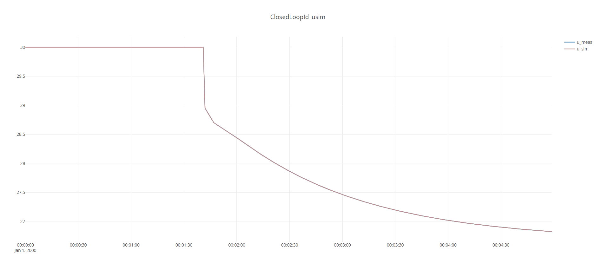

This example shows how the ``ClosedLoodIdentifier`` can be used to identify a model of a closed-loop system
as well as the disturbance (a time-series) that acted on the system. 

The code for this example:
[!code-csharp[Examples](../../TimeSeriesAnalysis.Tests/Examples/SystemIdent.cs?name=ex_CLOSED_LOOP)]

The output of ``idModel.ToString()`` gives details on the model:
```
ABLE to identify
TimeConstant : 12 sec
TimeDelay : 0 sec
ProcessGains(at u0) : 
	1.57 ± 4
 -> Linear Gain : 
	1.57 ± 4
 -> Curvature Gain : 
	NaN ± NaN
 -> u0 : [30]
 -> uNorm : [1]
Bias : 50 ± 1.6
```

The dataset created is shown below, a disturbance step creates a first order response in the output ''y_meas'', as the 
PID-controller works to bring ''y_meas'' back to the setpoint ''y_set``. In a real dataset, the actual disturbance would of course be unkown, 
but the advantage of creating a synthetic dataet is that the disturbance is known and can be compared to the estimate.


The below three plots show the comparison of ``u``, ``y`` and disturbance ``d`` for the given synthetic dataset with the result of
 `ClosedLoopIdentifier''. 




The measured and simulated ``y`` generally always tend to match due to how the disturbance signal is defined ``y_meas = y_model +d``,
so in essence the disturbance signal is selected so that these two signals match. 

The measured and simulated ``u`` on the other hand do not neccesarily need to match, but ``ClosedLoopIdentifier`` has by a combination 
of trial and error, and knowledge of the Pid-paramters chosen the UnitModel so that measured and simulated ``u`` match as closely as possible. 

While the actual gain was ``1.5`` and time-constant was ``10s``, the estimated result were ``1.57`` and ``12s``, thus the estimate of 
the distubance signal  ``d''has a small transient overshoot and a slightly too high amplitude as well, but the estimate is still quite good, given the
complex nature of estimating processes in closed-loop. 

This example is significant, because once the disturbance signal can be estimated, it becomes possible to
1. analyze correlation among PID-control loops to quantify the coupling, and
2. to re-simulate "what-if" simulations, of how the disturbance could have been rejected by other PID-tunings or even other control structures