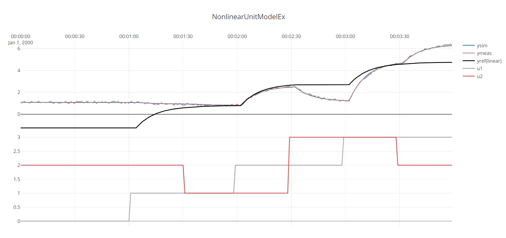
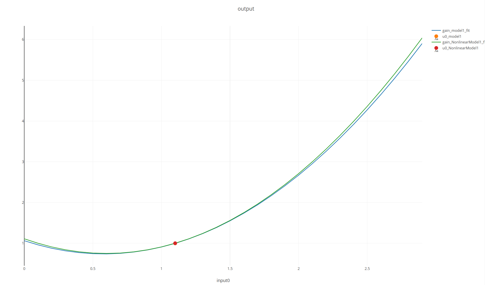
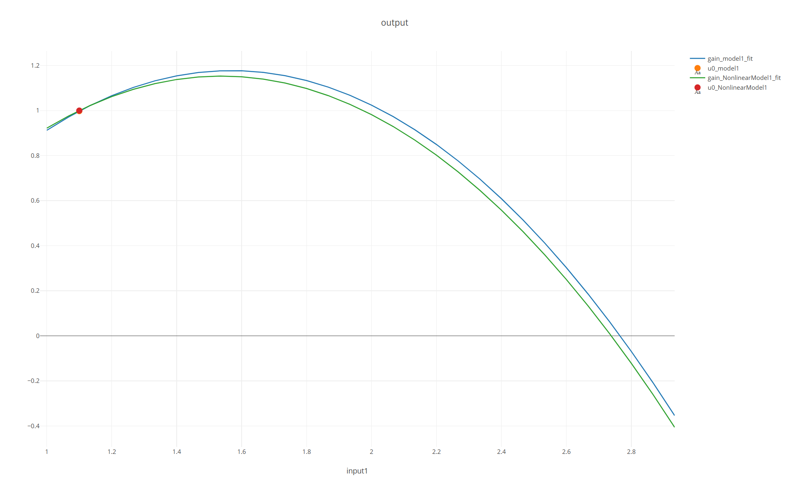

This example shows how the ``UnitIdentifier`` can be used to identify a model that
can include nonlinearities, time-delay and time-constant simultaneously.

The code for this example:
[!code-csharp[Examples](../../TimeSeriesAnalysis.Tests/Examples/SystemIdent.cs?name=ex_NONLINEAR_UNIT_MODEL)]

It can be hard to see with the naked eye that a combination of inputs (U) and output (y) 
are related non-linearly to another. For this reason, a reference linear model is also 
simulated and plotted for comparison purposes. The significant difference between 
``ymeas`` and ``yref(linear)`` in the below plot illustrate that the process is significantly non-linear. 

The resulting figure, containing the dataset, the fitted model and the reference linear model. 



The output of ``idModel.ToString()`` gives details on the model:
```
UnitModel
-------------------------
ABLE to identify
TimeConstant : 9,22 sec ± 3,5
TimeDelay : 4 sec
ProcessGains(at u0) : 
	1,97 ± 1,6
	-0,0525 ± 0,96
 -> Linear Gain : 
	0,998 ± 1,4
	0,77 ± 0,92
 -> Curvature Gain : 
	0,961 ± 0,026
	-0,821 ± 0,021
 -> u0 : [1.1;1.1]
 -> uNorm : [1;1]
Bias : 0,997 ± 1,3
```
Results: 
- the estimated bounds of the estimated time-constant contains the actual time-constant(10), 
- the estimated time delay matches the actual value (4),
- the estimated bound of linear gains contain the actual values ``[1,0.7]``
- the estimated bound of curvatures contain the actual values ``[1,-0.8]``
- the estimated bias is close to the actual value (1).

Overall, this is example shows a successful use of identification method. Under the hood 
``UnitIdenfier`` has *automatically* tested and evaluated a number of different linear/nonlinear and static/dynamic 
combinations before deciding on the returned nonlinear, dynamic model structure. 
**The major intended design benefit of using ``UnitIdentifier`` is that the user is spared
the details of this low-level model selection process.**

Notice that this dataset had *three* step changes for each of the two inputs, to ensure
that the curvatures were identifiable. In cases with less excitation in the dataset, 
identification could have returned a local linear model, even though the underlying process
was nonlinear. This is an unavoidable consequence of lack of excitation in the dataset, that one
has to be aware of.  

The user did *not* need to *specify* if the model should be linear or nonlinear, dynamic or static
 or if the model should have time-delay or not. ``UnitIdentifier`` does need a 
 ``UnitDataSet`` as input, thus the inputs(``U``) and output(``y``) need to be specified.
*Thus ``UnitIdentifier`` is not be able to take a general ``TimeSeriesDataSet`` that contain 
any number of un-ordered time-series and produce a general ``PlantSimulator``. 
This more challenging task will be a topic for later examples.* 

The gain-curves are plotted by the example code, plots shown below comparing true and estimted models:



