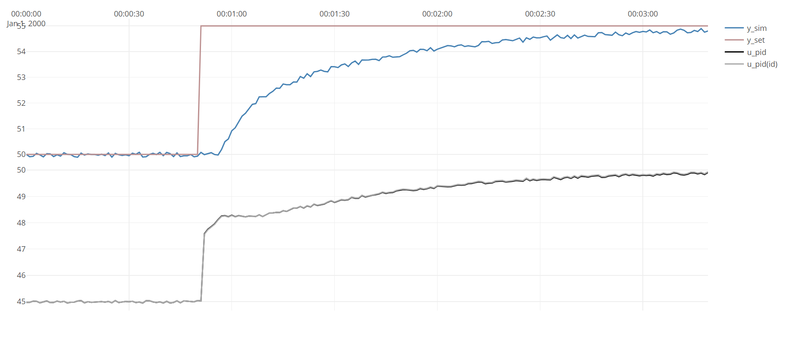

This example shows how the ``PidIdentifier`` class can identify the
paramters of a PID-controllers giving only the time-series. 

The dataset generated is simulated using ``PlantSimulator``, the 
code of this example:

[!code-csharp[ExamplePidID](../../TimeSeriesAnalysis.Tests/Examples/SystemIdent.cs?name=ex_PID_ID)]

The code generates the following figure, showing that the estimated 
paramters fit the actual PID-output ``u`` very well:



The output of ``idResult.ToString()`` gives details on the model:
```
TimeSeriesAnalysis.Dynamic.PidParameters
-------------------------
ABLE to identify
Kp : 0,496
Ti : 19,7 sec
Td : 0 sec
Scaling not given, default values used:
Umin : 0
Umax : 100
Ymin : 0
Ymax : 100
NO gainsceduling
NO feedforward
```
Note that the estimated parameters ``Kp=0.496`` and ``Ti_s=19.7`` are very close to the actual paramters. 

