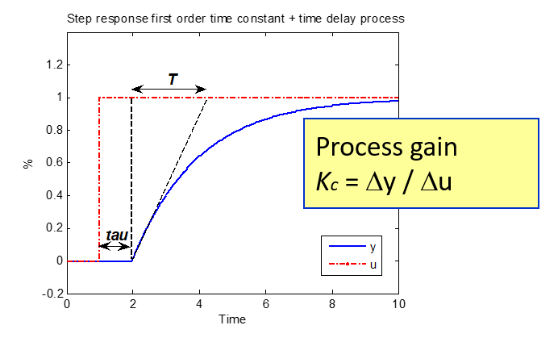

# Unit model first-order equations

As a design choice, during simulation the model is re-formualted as a steady-state model that is fed through a filter with gain 1.

---

#### The linear single-input model
For a single input-single output system from the input 
$u[t]$ to the output $y[t]$

will first attempt to look for linear first order models of the form:

$$
 T_c\cdot \frac{dy[t]}{dt} + y[t] = K_c \cdot (u[t-\tau] - u_0) 
$$

where:

- $K_c$ is the process gain,
- - $T_c$ is a time-constant, and
- $\tau$ is a time-delay 
- The model is localized around $u_0$, which is usually the centre of the tuning-data set, but this not so significant as long as we are dealing with linear models)

For most feedback loops, the process model can be described by such a linear model, because even nonlinear systems are linear locally around a working point, and the PID-controller will tend to 
keep the process close to a setpoint. It is sometimes said that ``the PID-controller linearizes the process``

The parameters of the unit model can be found by numerical fitting to time-series, but they can also be found visually from step-responses, as shown in the below figure:

In terms of the s-transform the above equation can be written as

$$
\frac{y(s)}{u(s)} = \frac{K_c}{T_c\cdot s+1} 
$$

so the above equation is merely a scaled low-pass filter.
#### Multiple input models
If the system has more than one input, then the above equation is extended with an additional gain for each input. 
For instance in the case of two inputs 
$u_1$ and $u_2$:

$$
 T_c\cdot dy[t]/dt + y[t] =  K_1 \cdot (u_1[t-\tau_1] - u_{1,0}) + \cdot K_2 \cdot (u_2[t-\tau_2] - u_{2,0})  
$$

the model has two gains 
$K_1$ and $K_2$.

#### Curvatures, local nonlinearity
The unit model can describe certiain weaker nonlinearities with a curvature 
$C$ and curvature term as follows:

$$
 T_c\cdot dy[t]/dt  + y[t] = K_c \cdot (u[t-\tau] - u_0) + \cdot C \cdot (u[t-\tau] - u_0)^2 
$$

Note that the linear gain term and the curvature term consider the same local operationg point 
$u_0$.

Similar to above, if there are more than one input, each of these can a curvature.
For instance in the case of two inputs 
$u_1$  and $u_2$:

$$
 T_c\cdot dy[t]/dt  + y[t] = K_1 \cdot (u_1[t-\tau] - u_{1,0}) + \cdot C_{1} \cdot (u_1[t-\tau] - u_{1,0})^2  +K_2 \cdot (u_2[t-\tau] - u_{2,0}) + \cdot C_{2} \cdot (u_2[t-\tau] - u_{2,0})^2 ) 
$$

It is also possible that some of the inputs have curvatures while others are linear.
#### The unit model identifier
The unit model identifier will automatically attempt fitting a different variations of the model 

* with and without time-delays
* static and with a time-contant 
* with and wihthout nonlinear curvature terms

and return the model that gives the best overall fit. 

*In the spirit of grey-box modelling, the user can and should in some cases override the estimated parameters if for some reason identification is unsuccesful.*
##### Differential form for a first order system
The actual difference equation found by the unit identifier needs to have the form 

$$
y[k] = a \cdot y[k-1] + b \cdot (u[k]-u_0) + q
$$
 to be able to identify paramters the easiest with linear regression.

But, for readability, the paramters should be re-interpreted as time-constants and gains, as these have a much more intuitive interpretation.

The unit identifier needs to solve the above differential equations by converting to differential form,
which will depend on the sampling time 
$$
T_s
$$
, sometimes referred to as the **timebase** in code.

$$
T_c\cdot \frac{dy[t]}{dt} \approx T_c \cdot \frac{y[k]-y[k-1]}{T_s}
$$

combined with 

$$
 T_c\cdot \frac{dy[t]}{dt} + y[t] = K_c \cdot u[t] 
$$

gives:

$$
 T_c \cdot \frac{y[k]-y[k-1]}{T_s}  + y[t] = K_c \cdot u[t] 
$$
 

$$
 \frac{T_c}{T_s} \cdot y[k] + y[t] - \frac{T_c}{T_s} \cdot y[k-1] = K_c \cdot u[t] 
$$
 

$$
  y[k] \left(\frac{T_c}{T_s}+1\right) = \frac{T_c}{T_s} \cdot y[k-1] + K_c \cdot u[t] 
$$
 

$$
  y[k]  = \frac{1}{1+ \frac{T_s}{T_c}} \cdot y[k-1] + K_c \cdot \frac{1}{1+ \frac{T_c}{T_s}} \cdot u[t] 
$$
 

So that 
$$
a = \frac{1}{1+\frac{T_s}{T_c}}
$$
 (notice that 
$
a
$
 must be smaller than one for a difference equation to be stable.)

Notice that 
$$
\frac{1}{1+ \frac{T_c}{T_s}} = 1 - \frac{1}{1+ \frac{T_s}{T_c}} = 1-a
$$

In post-processing parameters a and b are converted to time-constants and gains by 

$$
T_c = \frac{T_s}{1/a - 1}
$$
,

$$
K_c = \frac{b}{1-a}
$$

If there are curvatures, these equation above is extended with curvature terms, so that:

$$
y[k] = a \cdot y[k-1] + b \cdot (u[k]-u_0)  + c \cdot (u[k]-u_0)^2 + q
$$

and 

$$
C = \frac{c}{1-a}
$$

In the above difference equations, the term (a, b, c, q) are linear-in-parameters, meaning they can be found with linear regression.
#### Steady-state
The equation 

$$
y[k] = a \cdot y[k-1] + b \cdot u[k] + q
$$

is in steady-state when 

$$
y[k] =  y[k-1]  
$$

in which case:

$$
y[k] = a \cdot y[k]  + b \cdot u[k] + q
$$

$$
y[k] \cdot(1-a) = b \cdot u[k] + q
$$

So the steady-state gain from depends on 

$$
y[k] = \frac{b}{1-a} \cdot u[k] + \frac{q}{1-a} 
$$

#### First-order filter
When simulating the model, it is useful to think in terms of a steady-state respone y_ss that is fed through a filter.

From

$$
y[k] = a \cdot y[k-1] + b \cdot u[k] + q
$$

if 
$
u[k]= y_ss
$
, then the 
$
y[k] = y_ss
$
 in the steady-state. 

Since the steady state gain is 
$$
\frac{b}{1-a}
$$
 and this gain should be 1,

$$
b= 1-a, q=0
$$
 in the case of a filter with gain 1. 

The first-order filter of gain 1 is thus

$$
y[k] = a \cdot y[k-1] + (1-a) \cdot u[k] 
$$

---

### First order systems with integrator

Some first-order processes are integrating, which in the s-plane corresponds to systems of the form: 

$$
 \frac{y(s)}{u(s)} = \frac{K_c}{s \cdot (T_c \cdot s + 1)}
$$

This is a relevant for levels in tanks.

$$
 \frac{y(s)}{u(s)} = \frac{K_c}{s \cdot (T_c \cdot s + 1)} = \frac{K_c}{T_c\cdot s^2 + s} 
$$

$$
 y(s) \left( T_c\cdot s^2 + s \right)  = K_c \cdot u(s) 
$$

In the time domain this can be written as

$$
 T_c \cdot \frac{dy^2(t)}{dt} +  \frac{dy(t)}{dt}   = K_c \cdot u(t) 
$$

**Note that support for this kind of equation is currently not implemented**

